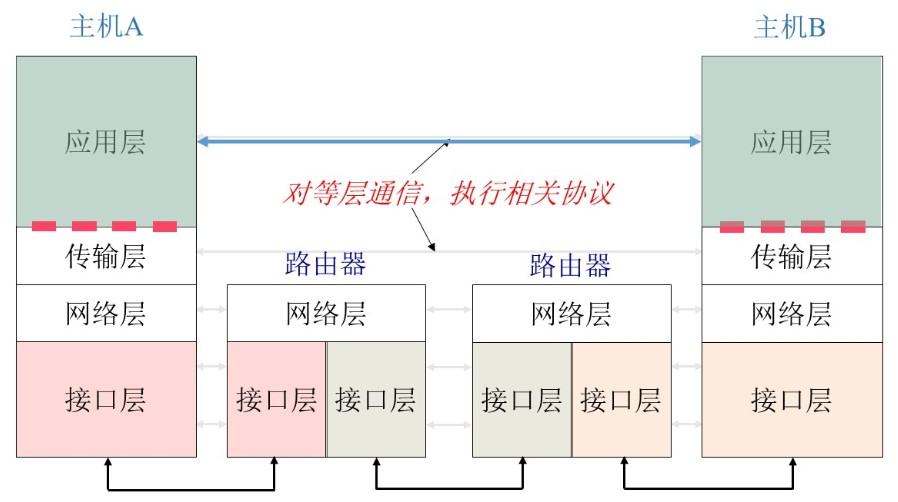
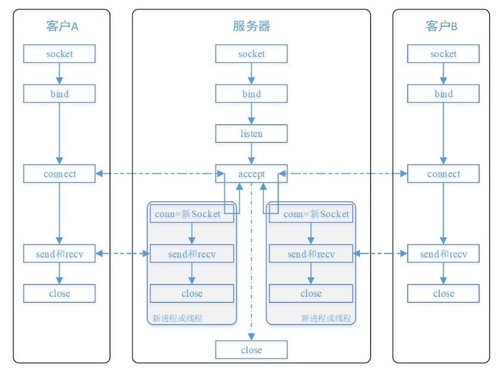
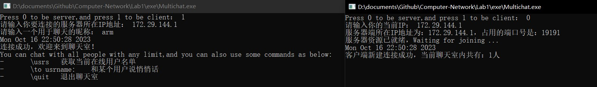
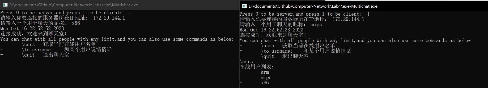
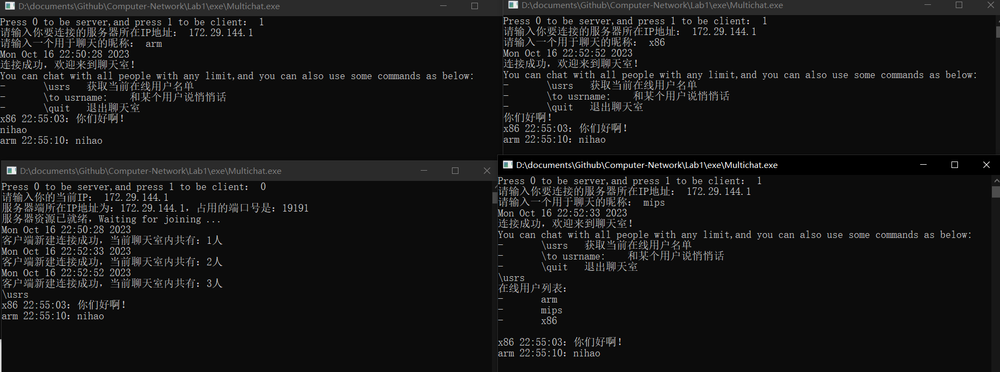
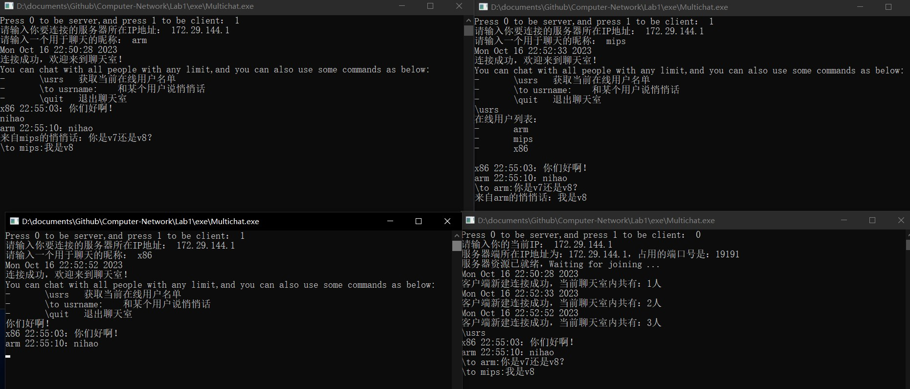
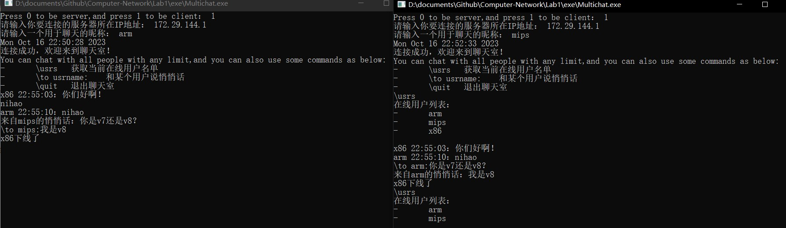
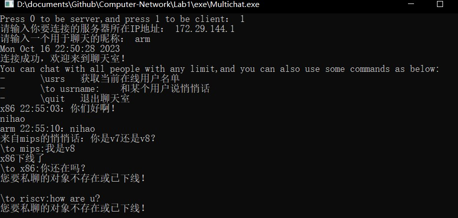
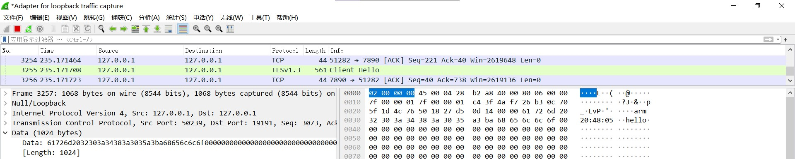

<h2 style="text-align:center"> 计算机网络第一次实验报告

<h4 style="float:right">姓名：曹珉浩&emsp;&emsp;学号：2113619

[toc]


> Lab1：利用Socket，编写一个聊天程序
>
> - 给出聊天协议的完整说明
> - 利用 C 或 C++ 语言，使用基本的 Socket 函数完成程序，不允许使用封装后的类
> - 使用流式套接字，采用多线程或多进程的性质完成程序
> - 程序要有基本的对话界面和正常的退出方式
> - 完成的程序应能支持多人聊天，支持英文和中文聊天
> - 程序应该结构清晰，具有较好的可读性
> - 在实验中观察是否有数据的丢失，提交源码与实验报告

#### 1.协议设计

##### 1.1 实验原理

在本实验中，我们基于如下图所示的 TCP/IP 体系结构进行设计：



<h6>1.1.1 协议

协议：协议是计算机网络中各实体之间数据交换必须遵守事先约定好的规则

我们在本次实验中主要需要设计**传输层协议**，定义应用交换的信息和收到信息后采取的行动

- **TCP协议**：面向连接，**可靠传输**，有流量控制和拥塞控制，但无法提供带宽和时延保证
- **UDP协议**：非面向连接，**不可靠**，不能提供流量控制、拥塞控制、时延和带宽保证

<h6>1.1.2 套接字

套接字 socket 是支持 TCP/IP 的操作系统为网络程序开发的典型网络编程界面

- 进程通过套接字发送消息和接收消息

- **数据报套接字：**使用UDP协议，支持主机之间面向非连接、不可靠的数据传输
- **流式套接字：**使用TCP协议，支持主机之间面向连接的、顺序的、可靠的、全双工字节流传输

<h6>1.1.3 客户/服务器进程交互模型

- 服务器进程：被动等待，长久在线，固定IP地址
- 客户进程：间歇性连接，可能使用动态IP地址，不和其他客户进行直接通信

##### 1.2 实验设计

在本实验中， 我们选择流式套接字，TCP协议来进行实验，使用TCP编写应用程序的大致步骤如下图所示：



<h6>1.2.1 服务端

- 首先创建套接字，填充 `SOCKADDR` 结构体，然后使用 `bind` 函数将socket与网络地址信息绑定、
- 进入监听状态后，不断检测请求队列并尝试建立连接，连接成功后填充用户信息
- 为每个用户新建一个线程，持续接收该用户发来的信息

<h6>1.2.2 客户端

- 创建套接字，填充 `SOCKADDR` 结构体，然后获取并绑定服务器信息(需要服务器ip地址)
- 使用 `connect` 函数尝试与服务器进行连接，连接成功则首先发送一些自己的信息，供服务器填充
- 创建一个线程用于接收消息，主线程用于发送消息

<h6>1.2.3 通信设计

- **多人聊天实现：客户端发送消息给服务端，服务端再发给所有和它建立连接的客户端，实现公聊效果**

- 私聊实现：由于客户端建立连接的时候首先发送了自己的信息，因此服务端可以分辨出不同的客户，客户端使用一些特定格式的语句发送给服务端，服务器就可以正确解析，作为中转将信息准确发送给客户私聊的对象

那么如何区分用户新建连接发来的消息、用户的正常公聊和命令语句呢？

**我们采用消息头的方式，即在用户发出的信息前加上特定语义符号：**

- `\` ：以反斜杠开头的命令代表命令，让服务器执行一些操作
- `n` ：代表用户的个人信息，为隐式封装，仅调用一次(因此后续用户也可以发送n开头的聊天内容)

最后，公聊消息也需要对发送内容进行一些封装，实验中采取的消息设计是：**用户名 发送时间:发送内容**

#### 2 程序设计

##### 2.1 服务端

首先定义一些常量，作用如下：

```c++
const int BUFFMAX = 1024; //发送，接收消息的缓冲区
const int MAX_QUEUE = 5; //监听队列最长为5人
const int LOCAL_PORT = 19191; //服务器的端口号
```

接着定义一些全局变量，记录服务器的服务信息

```c++
int CLIENT_NUMBER = 0; //有多少人在使用服务器
bool online[MAX_QUEUE] = { false }; //服务队列有效位
char recvBuff_S[BUFFMAX]; //接收消息缓冲区
char sendBuff_S[BUFFMAX]; //发送消息缓冲区
```

还有和用户信息相关的结构与全局变量：

```c++
struct clientInfo { //记录客户信息
    int id; // 队列编号
    char name[20]; //用户名字
};
```

```c++
HANDLE client_threads[MAX_QUEUE]; //用户线程数组，用于接收不同用户发来的信息
clientInfo ClientInfo[MAX_QUEUE]; //用户信息数组
SOCKET client_sockets[MAX_QUEUE]; //用户套接字数组
SOCKADDR_IN clientAddrs[MAX_QUEUE]; //用户地址信息数组
```

我们还需要一些辅助函数，方便服务端网络程序的开发：

```c
// 1.getLocalIP：获取服务器的当前IP，可通过ipconfig获得
char* getLocalIP()
{
    cout << "请输入你的当前IP： ";
    char* ip = new char[20];
    cin >> ip;
    return ip;
}
```

```c
// 2.findInQueue：在在线队列中寻找，若有false则证明可以继续接收用户连接
int findInQueue()
{
    for (int i = 0; i < MAX_QUEUE; i++) 
        if (online[i] == false)             
            return i;           
    return -1;
}
```

这些辅助信息和函数定义好后，就可以开始进行网络程序开发了，首先初始化 `winsock` 库：

```c
WSADATA wsadata;
int res = WSAStartup(MAKEWORD(2, 2), &wsadata);
if (res != 0) { //初始化成功才能进行后面的工作
	WSAGetLastError();
	system("pause"); //出错不立即关闭窗口
	return 1;
}
```

然后创建 `socket`，并填充地址信息，即 `SOCKADDR_IN` 结构，工作完成后，资源即就绪

```c
// 创建SOCKADDR结构，存储IPv4套接字的地址信息
SOCKADDR_IN serverAddr;
const char* SERVER_IP = getLocalIP();
serverAddr.sin_family = AF_INET;
serverAddr.sin_port = htons(LOCAL_PORT);
inet_pton(AF_INET, SERVER_IP, &serverAddr.sin_addr.S_un.S_addr);

// 将socket与网络地址信息绑定
int addrlen = sizeof(SOCKADDR);
bind(server_socket, (SOCKADDR*)&serverAddr, addrlen);
cout << "服务器资源已就绪，Waiting for joining ..." << endl;
```

进入循环监听，尝试与等待队列的客户端进行连接，

```c
listen(server_socket, MAX_QUEUE);
int index = findInQueue();
if (index != -1)  //说明找到了空位，可以进行连接
	// accept 成功后，会自动填充 SOCKADDR 结构体
    client_sockets[index] = accept(server_socket, (SOCKADDR*)&clientAddrs[index], &addrlen);
```

如果accept成功，服务端和客户端之间进行通信的基础就已经打好了，下面服务端要给客户端发送一些消息，提醒客户连接成功，还有一些聊天室使用的注意事项。在后续的客户端的设计中我们看到，客户连接后的第一件事是发送自己的信息，所以我们还要接收这部分消息，填充服务端的信息数组。最后，我们还要为每个客户建立一个线程，监听它们的消息：

```c++
if (client_sockets[index] != INVALID_SOCKET) {
	CLIENT_NUMBER++; //当前在线用户+1
	online[index] = true; //设置服务队列有效位v

    //获取用户连接时间：
    time_t now = time(0);
    char* connTime = ctime(&now);
    cout << connTime <<"客户端新建连接成功，当前聊天室内共有：" << CLIENT_NUMBER << "人" << endl;
	memset(sendBuff_S, 0, BUFFMAX);
	memset(recvBuff_S, 0, BUFFMAX);
    // 接受消息，填充用户信息：
    recv(client_sockets[index], recvBuff_S, BUFFMAX, 0);
	if (recvBuff_S[0] == 'n') { //n消息头，代表传输的是用户名字
		ClientInfo[index].id = index;
        int t = 1;
        while (recvBuff_S[t] != '\0') {
			ClientInfo[index].name[t - 1] = recvBuff_S[t];
            t = t + 1;
        }
        ClientInfo[index].name[t] = '\0';
    }
    // 提醒用户连接成功，并发送聊天室使用方法
	strcat(sendBuff_S, connTime);
    strcat(sendBuff_S, "连接成功，欢迎来到聊天室！\n");
    strcat(sendBuff_S, "You can chat with all people with any limit,
           and you can also use some commands as below:\n");
    strcat(sendBuff_S, "-\t\\usrs\t获取当前在线用户名单\n");
    strcat(sendBuff_S, "-\t\\to usrname:\t和某个用户说悄悄话\n");
    strcat(sendBuff_S, "-\t\\quit\t退出聊天室");
    send(client_sockets[index], sendBuff_S, BUFFMAX, 0);
    //为每个客户端新建线程来接受消息
    client_threads[index] = CreateThread(NULL, NULL, recvMessage_S, &ClientInfo[index], 0, NULL);
}
```

最后，服务端的程序还需要设计接收消息的函数，我们看到在创建线程时，`lpParameter` 参数设置为当前用户信息的地址，这是为了让服务器区别每个用户，并能方便的实现私聊等功能。

在这个函数中，我们要区别用户发的到底是命令还是公聊语句，即开头是不是`\`。**在本次实验中，我们主要设计了四条命令，分别供用户获取在线人员列表，发送私聊消息，以及退出聊天室：**

- `\usrs`：由服务端根据 `online` 数组，遍历对应的信息数组，封装好消息返回给执行这条命令的用户
- `\to usrname`：私聊命令，由服务器作为中转，将调用这条命令的用户发来的信息，发送给用户名为 `usrname` 的用户，如果该用户不存在或者已经下线，返回提示信息给命令调用者
- `\quit`：退出聊天室，并在公屏提醒所有用户，释放若干资源，由客户端发向服务端。服务端中实现
- `\EXIT`：结束程序，由服务端接收到客户端的 `\quit`后，返回消息给客户端。客户端中实现

```c++
//线程函数框架，接收客户信息：
DWORD WINAPI recvMessage_S(LPVOID lpParam)
{
    clientInfo* info = (clientInfo*)lpParam; //解引用，获得用户信息
    int cid = info->id; 
    while (true) {
        if (recv(client_sockets[cid], recvBuff_S, BUFFMAX, 0) >= 0) {
            // 在服务端显示用户发来的信息
            cout << recvBuff_S << endl;
            if (recvBuff_S[0] == '\\') { //首字符为反斜杠代表命令，由服务端返回一些信息
                // some codes...
                continue;
            } 
            // 如果不是命令语句，则就是正常的公屏聊天内容，服务器遍历在线用户列表进行发送
   		for (int i = 0; i < MAX_QUEUE; i++) 
			if (online[i] == true) 
				send(client_sockets[i], sendBuff_S, BUFFMAX, 0);                           
	}
    return 0;
}
```

下面对服务器端的三条命令的具体实现方式进行讲解，首先是 `\usrs` 命令，就是遍历在线用户列表，判断其 `online` 有效位是否为1，如果是则加入到发送消息缓冲区，当遍历结束后，统一发送：

```c
char tempBuff[BUFFMAX];
memset(tempBuff, 0, BUFFMAX);
strcat(tempBuff, "在线用户列表：\n");
for (int i = 0; i < MAX_QUEUE; i++) {
 	if (online[i] == true) {
		const char* tempName = ClientInfo[i].name;
		strcat(tempBuff, "-\t");
		strcat(tempBuff, tempName);
		strcat(tempBuff, "\n");
	}
}
send(client_sockets[cid], tempBuff, BUFFMAX, 0);   
```

然后是 `\to` 命令，这个命令较为复杂，首先要获取用户要私聊的名字，由于我们的命令以一个`:`结尾，所以只需要一个小循环即可截出用户名，然后根据这个用户名对在线列表进行遍历，如果不存在或已下线那么返回提示信息；如果在就仅向这个用户发送已经去掉前面命令格式的剩下的聊天内容：

```c
else if (recvBuff_S[1] == 't' && recvBuff_S[2] == 'o') { //私聊命令
	// 获取用户要私聊的对象
	char tempName[20] = { 0 };
    int k = 4; //前三个字符是\to 第四个字符是一个空格，因此从第五个字符开始截取
    while (recvBuff_S[k] != ':') {
		tempName[k - 4] = recvBuff_S[k];	
        k++;
	}
    tempName[k] = '\0';

   	char tempBuff[BUFFMAX];
    memset(tempBuff, 0, BUFFMAX);
    memset(sendBuff_S, 0, BUFFMAX);

    // 查询用户是否存在且在线，如果在就发送命令后的真正的消息
    for (int i = 0; i < MAX_QUEUE; i++) {
		if (strcmp(ClientInfo[i].name, tempName) == 0 && online[i] == true) {
			strcat(sendBuff_S, "来自");
            strcat(sendBuff_S, info->name);
            strcat(sendBuff_S, "的悄悄话：");
            strcat(tempBuff, recvBuff_S);
            strcat(sendBuff_S, tempBuff + k + 1);
            send(client_sockets[i], sendBuff_S, BUFFMAX, 0);
            break;
		}
		if (i == MAX_QUEUE-1) {
			// 如果不在线返回提示信息
            memset(tempBuff, 0, BUFFMAX);
            strcat(tempBuff, "您要私聊的对象不存在或已下线！\n");
            send(client_sockets[cid], tempBuff, BUFFMAX, 0);
		}	
	}
}
```

最后是 `\quit` 命令，告知其他用户下线(遍历在线列表发送消息)，然后发送`\EXIT` 消息给客户端，让它结束程序(客户端中实现)，最后关闭此用户所用的所有资源：

```c++
online[cid] = false; //online 有效位设为false
CLIENT_NUMBER--; //当前用户减少
cout << info->name << "下线了，当前聊天室内共有：" << CLIENT_NUMBER << "人" << endl;
//公屏发送用户下线通知
memset(sendBuff_S, 0, BUFFMAX);
strcat(sendBuff_S, info->name);
strcat(sendBuff_S, "下线了");
for (int i = 0; i < MAX_QUEUE; i++) 
	if (online[i] == true) 
		send(client_sockets[i], sendBuff_S, BUFFMAX, 0);                                       
memset(sendBuff_S, 0, BUFFMAX);
strcat(sendBuff_S, "\\EXIT"); //发送\EXIT消息，客户端会解析成\EXIT命令，退出程序
send(client_sockets[cid], sendBuff_S, BUFFMAX, 0);
closesocket(client_sockets[cid]); //关闭资源
```

##### 2.2 客户端

客户端也有一些常量与变量，用途不再赘述：

```c++
const int BUFFSIZE = 1024; //缓冲区大小，仅名字区别于server端
int CLIENT_PORT = 11451;、//客户端端口
int SERVER_PORT = 19191; //服务端端口
char recvBuff_C[BUFFSIZE]; //客户端接受消息缓冲区
char sendBuff_C[BUFFSIZE]; //客户端发送消息缓冲区
SOCKET client_socket; //客户端socket
```

前面的工作和服务端相同：初始化 `winsock` 库，填地址信息结构体(注意还需要填写服务器端的)，然后使用 `connect` 连接服务器，如果连接成功，首先将自己的信息打包，用于服务端的用户信息结构体填充：

```c
if (connect(client_socket, (SOCKADDR*)&serverAddr, sizeof(SOCKADDR)) != SOCKET_ERROR) {
	//发送自己的信息，填充服务器的用户结构
    int length = usrname.length() + 2;
    const char* sendName = usrname.c_str();
    memset(sendBuff_C, 0, BUFFSIZE);
    strcat(sendBuff_C, sendName);
    send(client_socket, sendName, length, 0);
    // ...
}
```

然后创建线程，用于接收消息，由于服务端转发的消息已经经过了封装，因此在客户端中直接打印输出即可

```c
HANDLE recv_thread = CreateThread(NULL, NULL, recvMessage_C, NULL, 0, NULL);
DWORD WINAPI recvMessage_C(LPVOID lpParam)
{
    while (true) {
        // 清空缓冲区
        memset(recvBuff_C, 0, BUFFSIZE);
        recv(client_socket, recvBuff_C, BUFFSIZE, 0);
        if (recvBuff_C[0] == '\\' && recvBuff_C[1] == 'E')  //实现\EXIT命令
            exit(0); //直接退出程序
        cout << recvBuff_C << endl;
    }
    return 0;
}
```

然后剩下发送消息的实现，由于用户信息分为命令语句和正常聊天语句，因此需要做不同的处理：如果是命令语句，那么直接转发给服务器，不进行任何修饰；否则需要加上自己的用户名字和发送消息的时间，再发给服务器。

```c
//主线程用于发送消息
while (true) {
	memset(sendBuff_C, 0, BUFFSIZE);
    char input[BUFFSIZE];
    cin.getline(input, BUFFSIZE);
    if (input[0] == '\\') { // 如果是命令消息那么直接发出，不进行修饰
		strcat(sendBuff_C, input);
		send(client_socket, sendBuff_C, BUFFSIZE, 0);
        continue;
	}
	//获取当前时间并格式化：
    time_t currentTime = time(0);
    struct tm now;
    localtime_s(&now, &currentTime);
    stringstream formattedTime;
	formattedTime << setfill('0') << setw(2) << now.tm_hour << ":"
		<< setfill('0') << setw(2) << now.tm_min << ":"
		<< setfill('0') << setw(2) << now.tm_sec;
	string timeString = usrname.substr(1) + " " + formattedTime.str() + "：";
	const char* mesg = timeString.c_str();
	strcat(sendBuff_C, mesg);
	strcat(sendBuff_C, input);
	send(client_socket, sendBuff_C, BUFFSIZE, 0);
}
```

##### 3.主函数

`main` 函数的实现非常简单，主要就是用于选择称为客户端还是服务端，然后执行对应的函数：

```c
#include <iostream>
#include "client.h"
#include "server.h"
#pragma warning(disable:4996)
using namespace std;
int main()
{
    int which;
    cout << "Press 0 to be server,and press 1 to be client： ";
    cin >> which;
    if (which == 0)
        server();
    else if (which == 1)
        client();
    return 0;
}

```

#### 3.如何使用

- 运行 `Multichat.exe`，进入后输入0可以成为服务端，输入1成为客户端
- 在客户端和服务端都需要输入服务端的IP地址，为了测试方便，可以输入回环地址127.0.0.1
- 在客户端输入一个用户名，用于接下来区分消息
- 客户端连接成功后，会收到连接成功的提示消息以及聊天室使用说明：
  - 可以直接发送任何消息，代表公共聊天
  - 可以在命令行里输入 `\usrs`，这将返回在线用户列表
  - 可以在命令行里输入 `\quit`，表示退出聊天室
  - 如果想和在线的某个用户进行私聊，可以在命令行里输入 `\to usrname: message`

#### 4.结果演示

选择0成为服务端，选择1成为客户端，在客户端需要输入一个名字，作为聊天昵称：



再接入两个客户，然后在一个客户端里输入 `\usrs` 命令，可以看见成功返回了在线成员列表，并且其他人屏幕上没有显示，说明我们的 `\usrs` 命令实现成功：



然后测试英文聊天与中文聊天，没有加命令，可以看到是正常的公屏聊天效果：



然后测试私聊命令，可以看到mips用户和arm用户的私聊效果，而非私聊用户(x86)无法看到其聊天内容：



下面让x86用户执行 `\quit` 命令，发现可以正常退出程序，公屏显示退出消息，再次使用 `\usrs` 命令正确进行了更新，说明这两条命令的实现都是正确的：



此外，如果试图私聊一个已经下线的用户或者不存在的用户，都会失败并且返回提示信息：



经过上面的若干测试，我们的多人聊天程序实现无误(包括几条特定的命令)，并且没有数据丢失

再打开Wireshark进行抓包测试(这次令客户端和服务端地址都为回环地址127.0.0.1，方便我们观察结果)，arm用户输入hello，发现仍然没有数据丢失：




#### 5.遇到的问题以及解决方案

- 服务端收到的客户端的聊天内容发不出去：因为在客户端中，在 `send` 公聊消息给服务端时，对信息进行了封装，因此在服务端处理公聊消息时，自然的逻辑就是直接把这段内容直接 `send` 给所有在线用户，但却实现失败，原因是不能将 `recv_Buff` 直接当作 `send_Buff` 进行发送，即需要先清空缓冲区，再进行 `strcat`：

  ```c
  memset(sendBuff_S, 0, BUFFMAX);
  strcat(sendBuff_S, recvBuff_S);
  ```

- 在WireShark测试时，发现怎么都找不到自己发出的包，原因是WireShark默认不能监听127.0.0.1的网络通信，需要安装一个npmap，再进入软件，点击 `Adapter for loopback traffic capture`而非 `WLAN`即可正确抓包

- 若干格式错误：反复debug，并借助 WireShark


**仓库地址**：visit the [Github](https://github.com/MrGuaB1/Computer-Network)