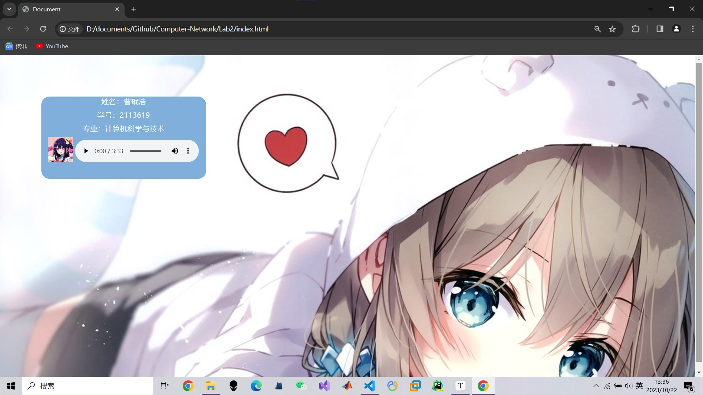

<h2 style="text-align:center"> 计算机网络第二次实验报告

<h4 style="float:right">姓名：曹珉浩&emsp;&emsp;学号：2113619

[toc]

> Lab2：配置Web服务器，编写简单页面，分析交互过程
>
> - 搭建Web服务器，并制作简单的Web页面，包含简单文本信息，Logo，音频信息
> - 通过浏览器获取自己编写的Web页面，使用WireShark捕获浏览器和Web服务器的交互过程，并进行简单的分析说明
> - 使用HTTP，不要使用HTTPS

#### 1.搭建服务器，编写Web界面

##### 1.1 Web页面编写

搭建一个简单的Web页面，包含了文本信息，图片信息和音频信息：

```html
<body>
    <div class="center">
        <div class="name">
            <p class="text">姓名：曹珉浩</p>
            <p class="text">学号：2113619</p>
            <p class="text">专业：计算机科学与技术</p>
            <div>
                
                <audio src="img/idol.mp3" controls></audio>
            </div>         
        </div>
    </div>
</body>
```

然后，进行一些简单的装饰：

```css
<style>
    * {
        padding: 0;
        margin: 0;
    }
    .center {
        width: 100%;
        height: 800px;
        text-align: center;
        background-image: url(img/bg.jpg);
        background-repeat: no-repeat;
        position: relative;
    }
    .name {
        width: 400px;
        height: 200px;
        background-color: rgb(129,175,219);
        position: absolute;
        border-radius: 20px;
        top: 100px;
        left: 100px;
    }
    .text {
        color:aliceblue;
        margin-bottom: 10px;
        font-size: 18px;
    }
    .logo {
        height: 60px;       
    }
</style>
```

Web页面完成后的效果如下：



##### 1.2 搭建Web服务器

首先，打开程序面板，依次点击程序、启用或关闭windows功能，打开网络服务：


然后再次打开程序面板，依次打开管理工具，IIS，出现如下页面：


接着新建网站，选择一个端口号，并使用HTTP协议：


最后，通过 **http://localhost:8080/index.html**，即可访问我们编写的网站

此外，也可以通过 **http://ipAddress:port/index.html** 访问

#### 2.使用Wireshark捕获并分析交互过程

由于我们分配了端口号8080，因此在Wireshark中可通过这一点进行捕获过滤，输入 `tcp.port == 8080`，然后跟踪 `GET /index.html` 的TCP流，就可以得到全部的交互过程：


在详细分析这个交互过程之前，我们首先要知道一些TCP的知识：

##### 2.1 TCP的状态

在TCP层，有个 **FLAGS字段**，这个字段有以下几个标识：SYN, FIN, ACK, PSH, RST, URG。其中，对于我们的分析有用的就是前面的五个字段，它们的作用是：

- SYN表示建立连接，在TCP三次握手阶段起作用
- FIN表示关闭连接，在TCP四次挥手阶段起作用
- ACK表示响应
- PSH表示有数据传输
- RST表示连接重置，可以是一种中断连接的方式

##### 2.2 阶段1：TCP三次握手建立连接


在正式三次握手之前，TCP服务器进程和TCP客户进程会先创建传输控制块TCB，此时服务器进入监听状态，接收客户的发出连接请求的报文，然后开始三次握手：

- 第一次握手：客户向服务器发出连接请求报文，**设置SYN=1，同时选择一个初始序列号 seq=x **，这时，客户端进程进入了 **SYN-SENT**，即同步已发送状态。同时，TCP规定，SYN报文段（`SYN=1`的报文段）**不能携带数据**，但需要消耗掉一个序号
- 第二次握手：TCP服务器收到请求报文后，如果同意连接，则发出确认报文，在确认报文中，`ACK = 1,SYN = 1`，并且响应号 `ACK` 应该是初始序列号`x`加上1。同时，也要为自己初始化一个序列号 `seq=y`，此时，TCP服务器进程进入了 **SYN-RCVD**（同步收到）状态。**这个报文也不能携带数据**，但是同样要消耗一个序号。
- 第三次握手：TCP客户进程收到确认后，还要向服务器给出确认。确认报文的`ACK=1`，自己的序列号 `seq=x+1`，此时，TCP连接建立，客户端进入ESTABLISHED（已建立连接）状态。TCP规定，**ACK报文段可以携带数据，但是如果不携带数据则不消耗序号。**

三次握手结束后，双方就可以开始通信了。从上面的过程中我们不免提出疑问，为什么还需要第三次握手呢，即TCP客户端为什么最后还要发送一次确认呢？

原因是**防止已经失效的连接请求报文突然又传送到了服务器，从而产生资源浪费**

> 在Wireshark中，seq表示TCP报文段的序列号，用来标识和排序TCP数据，以确保它们在接收端被正确地重组与排序，此外，通过序列号还可以检测丢失的数据报文段

在本次实验中，TCP三次握手对应的包即为最上面三条：


可以看到，首先客户端向服务端发起第一次握手(53320 $\to$ 8080)，并且客户端选择了初始序列号 `seq = 0`；然后服务端向客户端发起第二次握手(8080 $\to$ 53320)，并且客户端也选择初始序列号 `seq = 0`；最后客户端向服务端发起第三次握手(53320 $\to$ 8080)，避免连接失效，同时客户端消耗一个序列号，新的序列号为 `seq = 0 + 1 = 1`。同时我们看见，三个包的 `len` 字段都是0，代表不携带数据

我们还可以在Wireshark下面看到一些更详细的信息：


比如网络层协议为IPv6(回环地址导致)，传输层协议为TCP，以及传输端口和目的端口等。此外，还有最重要的TCP状态字段，三次握手的详细状态如下面三张图所示：

<div>
    
   	
    
</div>


可以看到，正如上面所分析，前两次握手的 `SYN` 段为1，表示建立连接的过程，而后两次握手的 `ACK` 段为1，表示响应

##### 2.3 阶段2：通信过程

在这个阶段中，客户端不断向服务端中获取资源，然后服务端寻找资源并返回，并跟着一个状态码：

- **200**：OK，表示客户端请求成功，被请求的对象包含该响应的数据部分
- **304**：Not Modified，由于浏览器的缓存机制，会保留一些图像等资源，用户刷新后不会重新从服务端GET，降低了时延和网络流量，此状态码表示对象未被修改
- **400**：Bad Request，服务器不能解释客户端的请求报文
- **404**：Not Found，服务器中找不到客户请求的对象

###### 2.3.1 HTML 文档获取

由于我们访问的是 `index.html`，所以会首先向服务器发送一个 `GET index.html`的请求


客户端向服务端发送一个HTTP请求(使用GET请求方法)之后，服务端首先返回了一条消息，表示接收到用户的请求(8080 $\to$ 53320)，并附带回一个200状态码，表示请求成功，返回了html文档中的文字(text/html)；客户端接收到后，向服务器返回消息表示收到(53320 $\to$ 8080)

下面仔细分析一下这个带GET参数的HTTP请求，wireshark捕获的详细信息如下：

<div>
    
   	
</div>


可以看到，左图中除了端口信息以外，还标注了TCP有效数据长度(`TCP Segment Len`)为667，因此它需要占667个序列号，下一个序列号 `seq=1+667=668`。此外，还有TCP头部数据`Header = 20`；右图就是TCP数据报的状态位，可以看到由于有数据传输，因此`PSH`位被置位，由于响应，`ACK`位被置位，与前面的分析一致

> TCP数据报通常包括首部 `Header` 和有效数据 `TCP Segment Len`，`TCP Segment Len` 这个字段非常有用，可以帮助我们确定通信中的数据传输速率，以及检测是否发生了分段(如后续过程所示)

接着再看带返回状态码的HTTP请求，它返回HTML文档的信息，wireshark捕获的详细信息如下：

<div>
    
   	
</div>


可以看到，这两部分基本和上一条HTTP请求的内容一样，那它们之间到底有什么区别呢？

最大的区别为它们是HTTP的两种不同的报文类型：**请求报文和响应报文**，格式具体如下：

<div>
    
   	
</div>


Wireshark也为我们捕获了这两种报文格式，分别如下图所示，可以清楚的看到符合上述规范：

<div>
    
   	
</div>


此外，在响应报文的最下面，就是我们获取的HTML文档，可以看出就是我们所编写的代码，并且没有产生数据丢失，证明传输成功

###### 2.3.2 图片与音频获取

接下来的过程是，用户尝试解析HTML文档，但是发现缺少HTML文档中嵌入的非文字资源，比如图像，音频等，这个时候就要重新发起GET请求，向服务器请求这些资源，首先，发起页面logo的请求，捕获的数据包如下：


前两个数据报和前面一样，客户端发出请求，客户端返回信息告知接收请求，然后接下来的三条，和上面不同的是，多返回了 `TCP segment of a reassembled PDU`，这是由于要传输的内容较大(logo大小为13w+字节)，被分成了若干个分段进行传输，当所有分段都传输完毕的时候，重新拼装组成完成的PDU。

> TCP是一个面向连接的协议，它使用数据段（segments）来传输数据。这些数据段可能需要在传输过程中被分割成更小的块，以适应网络传输的要求。当接收方接收到这些分段后，它会根据TCP头部中的序列号和数据偏移等信息，将它们重新组装成原始的PDU（Protocol Data Unit），以便上层协议（例如HTTP、SMTP等）能够正确解释和处理数据

具体来说，我们的这个logo被分成了三个分段，前两个分段的长度为65475字节，第三个分段为351字节，并且值得注意的是，前两个分段在传输时，并没有把 `PSH` 置位，而是等到所有分段全都传输完毕，(第三个分段时)才把 `PSH` 置位。

接着，在服务端返回 `OK` 状态码之前，我们看见比起前面，多了一个客户端到服务端的数据报，其作用是告诉服务端成功收到分段传来的内容，并且注意到，客户端的序列号 `seq` 也已经成功更新，加上了图片大小偏移

最后两条和前面的作用一样，服务端返回状态码，客户端表示收到

相比图片资源，音频资源更大(341w+字节)，捕获的数据报如下(部分)：


可以看到，就是我们在图片资源分析时过程的多次重复，省去更多的重复过程，我们发现，当所有分段传输完毕的时候，响应报文和前面也都有所区别：


这里并没有返回 `200 OK` 状态码，而是返回 `206 Partial Content`，这也是获取资源成功，只不过意味着HTTP响应中的部分内容被传输，这通常与请求报文中的 `Range` 字段有关，找到请求报文：


其Range字段为 `bytes = 0\r\n`，表明申请全部资源，在响应报文中看一下是否真的获取了全部资源：


可以看到确实获取了全部341w+字节，即使返回的状态码不是200，我们也成功获取了全部资源

> Range请求头字段允许客户端请求服务器发送资源的指定范围，而不是整个资源。服务器可以响应这些请求，只发送资源的一部分，这就是 "partial content"。这对于大型文件下载、断点续传和流媒体传输等场景非常有用

##### 2.4 阶段3：TCP四次挥手释放连接


数据传输完毕后，双方都可释放连接，在释放过程中，需要**四次挥手**：

- 第一次挥手：客户端进程发出连接释放报文，并且停止发送数据。释放数据报文首部，设置 `FIN = 1`，其序列号为seq=u（u为前面已经传送过来的数据的最后一个字节的序号加1），此时，客户端进入**FIN-WAIT-1**（终止等待1）状态。 TCP规定，**FIN报文段即使不携带数据，也要消耗一个序号**
- 第二次挥手：服务器收到连接释放报文，发出确认报文，此时，服务端就进入了 **CLOSE-WAIT**（关闭等待）状态。TCP服务器通知高层的应用进程，客户端向服务器的方向就释放了，这时候处于半关闭状态，**即客户端已经没有数据要发送了，但是服务器若发送数据，客户端依然要接受**。这个状态还要持续一段时间，也就是整个CLOSE-WAIT状态持续的时间
- 第三次挥手：客户端收到服务器的确认请求后，此时，客户端就进入**FIN-WAIT-2**（终止等待2）状态，**等待服务器发送连接释放报文**，服务器将最后的数据发送完毕后，就向客户端发送连接释放报文，并将 `FIN` 置位，此时，服务器就进入了 **LAST-ACK**（最后确认）状态，等待客户端的确认。
- 第四次挥手：客户端收到服务器的连接释放报文后，必须发出确认，`ACK`置位，此时，客户端就进入了 **TIME-WAIT** 状态。注意此时TCP连接还没有释放，**必须经过2∗MSL（最长报文段寿命）的时间后，当客户端撤销相应的TCB后，才进入CLOSED状态**，而服务器只要接收到客户端传来的 `ACK` ，就可以直接进入CLOSED状态

根据这个四次挥手的过程，我们可以很容易提出两个问题：

> Q1：为什么客户端最后还要等待两个MSL？

这是为了**保证客户端发送的最后一个ACK报文能够到达服务器**，因为这个ACK报文可能丢失，站在服务器的角度来看，我已经发送了FIN+ACK报文请求断开了，客户端还没有给我回应，应该是我发送的请求断开报文它没有收到，于是服务器又会重新发送一次，而客户端就能在这个2MSL时间段内收到这个重传的报文，接着给出回应报文，并且会重启2MSL计时器

> Q2：为什么建立连接是三次握手，而释放连接却要四次挥手？

这是因为在建立连接的时候， 服务器在 LISTEN 状态下，收到建立连接请求的 SYN 报文后**，可以把 ACK 和 SYN 放在一个报文里发送给客户端；**

而关闭连接时，服务器收到客户端的 FIN 报文时，**仅仅表示对方不再发送数据了但是还能接收数据**，而自己也未必把全部数据都发送给对方了，所以服务端可以选择立即关闭，也可以选择再发送一些数据给客户端后，再发送 FIN 报文给对方来表示同意现在关闭连接，因此，**服务端ACK和FIN一般都会分开发送，从而导致多了一次挥手过程**

接受完全部的资源后，剩下的数据报如下：


可以看到在四次挥手之前还有一个 `TCP Window Update`，TCP窗口是用来管理数据流控制和拥塞控制的一个重要机制，它是指接收方通知发送方，他可以接收更多的数据，但由于我们没有更多的数据了，因此这条数据报没有什么实际意义

然后是客户端向服务端的第一次挥手，表示自己不再发送数据，观察数据包，发现 `FIN` 被置位，和上述分析的一样。此时，客户端进入**FIN-WAIT-1 **状态


接下来是服务端向客户端的两次挥手，第二次挥手服务端向客户端发送收到报文，将 `ACK` 置位；第三次挥手服务端发送释放报文，将 `FIN` 置位，并等待客户端发来的确认报文，可以看到，服务端的 `ACK` 和 `FIN` 确实是分开发送的

<div>
    
   	
</div>


最后是客户端对服务端的第四次挥手，`ACK` 置位表示确认，最后断开连接，四次挥手完毕


> 注：这里的客户端的端口号发生变化的原因是原端口号53320的抓取过程第四次挥手产生了一个异常

> 
>
> RST标志表示重置连接，可能是网络发生了错误，也可能是服务器没有收到客户端发来的确认数据报导致的，但清除浏览器历史记录再次捕获交互过程时，没有出错，如上图的62413端口客户端。由于两次抓包过程的获取资源的顺序有一些差别，前文都是按照53320端口的顺序进行分析，因此没有把全部的分析图片改为62413端口的客户端。
>
> 两次抓包的pcapng文件，都可以在压缩包或者 [GitHub仓库](https://github.com/MrGuaB1/Computer-Network/tree/main/Lab2) 中找到

#### 3.总结

借助Wireshark，我们很清晰地看到了浏览器和Web服务器之间的交互过程，即通过TCP三次握手建立连接；然后通过带GET方法的HTTP请求向服务器获取HTML文档，拿到文档进行解析，对其中缺失的资源再次进行GET，在基于TCP的传输中，大资源文件会被分成若干段进行传输；最后通过TCP四次挥手释放连接。


本实验的所有代码、资源以及实验报告，都可以在压缩包或者 [GitHub仓库](https://github.com/MrGuaB1/Computer-Network/tree/main/Lab2) 中找到。

有关TCP三次握手和四次挥手的详细知识，来源于PPT以及[这篇博文](https://juejin.cn/post/6986257880827559973)
