<h2 style="text-align:center"> 计算机网络第三次实验报告

<h4 style="float:right">姓名：曹珉浩&emsp;&emsp;学号：2113619

[toc]

> Lab3：基于UDP服务设计可靠传输协议并编程实现
>
> 3-1 具体要求：利用数据报套接字在用户空间实现面向连接的可靠数据传输，功能包括：建立连接、差错检测、接收确认、超时重传等。流量控制采用停等机制，完成给定测试文件的传输

#### 一、协议设计

##### 1.1 UDP 与 rdt3.0

<h6> 1.1.1 数据报选择：UDP

本次实验采用**数据报套接字UDP**实现单向可靠传输，其中，UDP的数据报文格式如下：

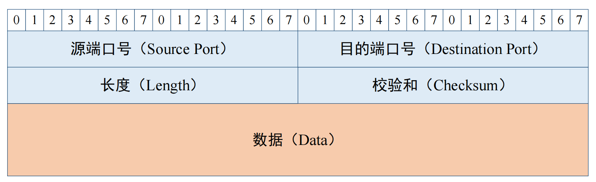

要想实现可靠传输，校验和域段就显得格为重要：UDP数据报的差错检测就是利用自己产生的**伪首部**和发送(接收)的UDP数据报计算校验和，其中伪首部包含源IP地址、目的IP地址、协议类型等域段，计算方法如下：

- **发送端**：产生伪首部，校验和域段清0，将数据报用0补齐为16的整数倍，然后进行16位二进制反码求和计算，并把结果写入校验和域段
- **接收端**：产生伪首部，将数据报用0补齐为16的整数倍，然后进行16位二进制反码求和计算，如果计算结果的16位全为1，则传输过程没有差错，否则说明数据报存在差错

在后续的实现中，我们将基于此实现两个函数，实现UDP数据报的差错检测。

<h6> 1.1.2 可靠传输协议：基于 rdt3.0

在rdt2.0时，使用**ACK标志位**表示接收端通知发送端分组正确接收，使用**NAK标志位**来表示接收端通知发送端接收的分组存在错误，发送端收到NAK时则重传分组，然而存在的问题是：ACK或者NAK受损，简单进行重传可能导致重复接收。

rdt3.0使用**序列号seq**验证标志位是否损坏，并且不再使用NAK：接收端通过发送对最后正确收到的分组的ACK代替NAK，同时ACK中必须携带所确认分组的序列号。还引入了超时时间，如果发送端过了一段时间还没有接收到接收端发来的ACK，则重传分组。这种简单但存在效率问题的方式，就是我们本次实验的流量控制方法：**停等机制，即发送端发送一个分组，然后等待接收端响应**。

##### 1.2 报文格式设计

我们仿照上面的UDP报文格式，设计如下的格式，包括数据报首部和具体数据内容：

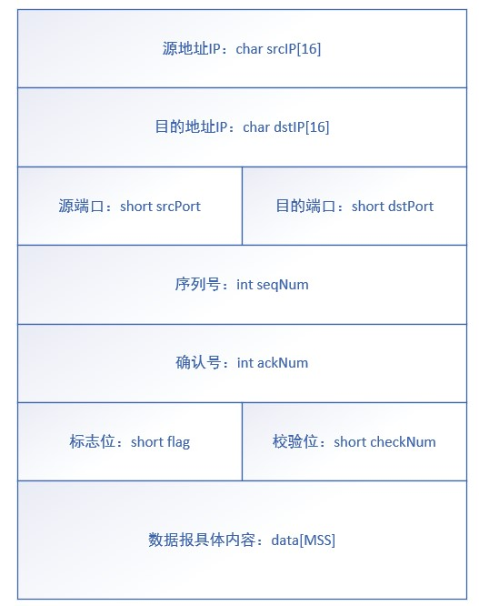

在后续代码实现过程中，我们通过一个内存地址连续的结构体来存储：包含4字节的源IP地址、目的IP地址；2字节的源端口、目的端口；4字节的序列号和确认号；2字节的标志位和校验位；还有最后的数据报具体内容，其长度为MSS，即最大段长度。

其中，两字节的标志位在本实验中用于判断是否将ACK，FIN，SYN等字段置位。

##### 1.3 连接建立设计

我们仿照上次实验中捕获的TCP三次握手的过程，通过自行设计的三次握手建立连接：

- 第一次握手：客户端向服务端发起请求，**携带初始序列号 `seq = x`**，并且需要把 **SYN** 标志位置位，表示建立连接。服务端接收到数据报后，需要检验校验和，**SYN标志位**和序列号，如果发生错误则连接建立失败。
- 第二次握手：服务端向客户端回复请求，携带初始序列号 `seq = x`，然后把 **ACK 和 SYN 标志位置位**，表示响应和建立连接。同样，客户端接收到服务端的数据报也需要检查。

> 需要注意，TCP协议中，规定SYN报文段不能携带数据，但需要消耗一个序列号，因此seq在正常情况下要+1，我们在此也遵从这个规定，发送SYN报文段后，将序列号+1

- 第三次握手：客户端向服务端最终确认，这次客户端只需要将 **ACK置位**

三次握手检查无误后，连接即建立完毕，然后开始数据传输。需要注意的是，**数据报传输过程中可能存在丢失，乱序等情况**：当出现丢失情况时，我们采取的策略是**超时重传**；当出现乱序情况时，我们的解决办法是**检查序列号**，具体实现将在程序设计中给出。

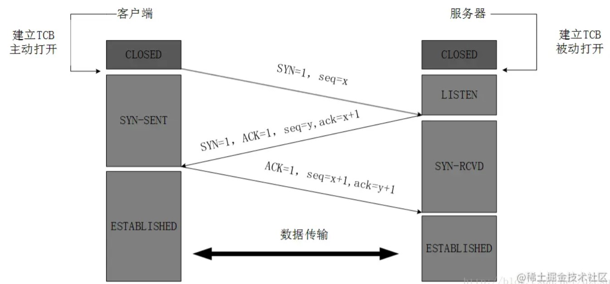

##### 1.4 数据传输设计

<h6> 1.4.1 客户端：发送数据

客户端将数据封装到结构体中之后，就进行发送，由于我们采用**停等机制**进行流量控制，因此我们还需要维护一个时钟并设置最长等待时间，**当发送时开始计时**，然后进入循环，监听收到的服务端的信息：

- 如果收到服务端传来的报文并且 ACK标志位、序列号、校验和等都无误，则数据报传输正确，退出循环
- 若收到了报文但上述三个条件发生差错，不退出循环，等待超时后再次传输报文
- 如果超时仍未收到报文，则重新传输

<h6> 1.4.2 服务端：接收确认

服务端在一个循环中不断监听客户端，接收消息，接收到我们设计的数据报后进行解析，检查校验和域段，并且在传输过程中可能产生乱序现象，我们还需要**检查序列号：我们期待的序列号是当前服务端的序列号+1，如果不满足则拒绝接收，等待客户端的超时重传**。如果没有发生乱序现象，那么服务端还要发送一个 **ACK 报文**，表示成功接收到数据。

> 但需要注意的是：这个 ACK 报文如果丢失应该如何处理呢？在客户端的实现中，如果迟迟没有收到服务端发来的 ACK，那么客户端会认为自己发送的数据报丢失了，那么当超时的时候，就会重传数据报，因此我们在服务端要丢失重复分组，并且重传 ACK 报文。

##### 1.5 连接释放设计

同样，我们仿照TCP四次挥手的设计，实现我们的四次挥手释放连接：

- 第一次挥手：客户端向服务端发送释放连接请求，并且需要把 **FIN** 置位，表示释放连接，服务端需要检验 FIN 标志，序列号以及校验和，如果正确则第一次挥手成功，客户端**自此不再向服务端发送任何数据**，进入 **FIN-WAIT1状态**
- 第二次挥手：服务端回应客户端，发出确认报文，ACK 置位，进入 **CLOSE-WAIT** 状态，然后客户端进行 ACK、序列号、校验和检查，无误则第二次挥手成功，客户端进入 **FIN-WAIT2状态**，等待释放连接报文
- 第三次挥手：仍然是服务端向客户端，但这次是**释放连接报文**，**需要把 ACK 和 FIN 都置位**，此时，服务器进入 **LAST-ACK**（最后确认）状态，等待客户端的检查和确认
- 第四次挥手：检查无误后，客户端向服务端最终确认，发送完毕之后还要等待 **2*MSL**，避免报文未到达

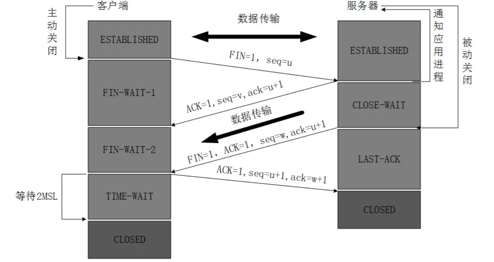

#### 二、程序设计

##### 2.1 报文格式与常量

首先，定义最长等待时间、最大段长度和最大传输文件大小：

```c
const int MAX_WAIT_TIME = 1000; // 超时时间
const int MSS = 10000; // 最大段长度
const int LONGEST = 200000000; // 最大文件大小
```

然后定义在程序中需要使用的三个标志位：我们把它设计成2的整次幂，这样与下面报文中的 `flag` 字段进行与操作，就可以知道标志位是否进行了置位：

```c
const unsigned short SYN = 0x1;  // 建立连接
const unsigned short ACK = 0x2;  // 响应
const unsigned short FIN = 0x4;  // 释放连接
```

接着定义传输报文格式的结构体(客户端和服务端相同)：

```c
struct Message
{
	// 数据报首部
	char srcIP[16], dstIP[16];
	unsigned short srcPort, dstPort;
	unsigned int seqNum; //序列号 seq
	unsigned int ackNum; //确认号 ack
	unsigned int size; //数据大小
	unsigned short flag; //标志位
	unsigned short checkNum; //校验位

	// 数据报内容，字节流报文
	char data[MSS];

	Message();
	bool getCheck(); // 求校验和，如果结果的16位整数全为1则返回true
	void setCheck(); // 设置校验位，将数据报补齐为16的整数倍，并且按位取反求和放入校验位
	void setPort(unsigned short src, unsigned short dst); // 设置源端口和目的端口
	void set_SYN() { flag += SYN; }
	void set_ACK() { flag += ACK; }
	void set_FIN() { flag += FIN; }
};
```

对于校验和的设置(**差错检测要求**)，我们要把数据报的字节用0补齐为16的整数倍，然后每两个16位整数进行反码求和运算，高位产生的1清0并在末尾加1，具体实现代码如下：

```c
void Message::setCheck()
{
	this->checkNum = 0; // 校验和字段清0
	unsigned int sum = 0;
	// 把当前的结构体当成一个16位的数组，后续遍历这个数组，每两个16位数进行求和
	unsigned short* dataAs16bit = (unsigned short*)this;
	// 循环次数为总位数/16，即总字节数/2
	for (int i = 0; i < sizeof(*this) / 2; i++)
	{
		sum += *dataAs16bit++;
		if (sum & 0xFFFF0000) // 如果相加后的32位整数的高16位不为0
		{
			sum &= 0xFFFF; // 把高16位清0
			sum++;
		}
	}
	this->checkNum = ~(sum & 0xFFFF); // 计算结果取反放入校验和字段
}
```

而对于校验和的获取，和上述代码类似，只不过要再进行一个和 `0xFFFF` 的按位与运算，即判断是否16位都是1，如果是的话则返回 `true`，表示传输无误：

```c
if ((sum & 0xFFFF) == 0xFFFF) // 如果16位都是1，那么数据报没有发生错误
	return true;
return false;
```

##### 2.2 建立连接

<h6> 2.2.1 客户端三次握手实现

```c
bool shakeHands()
{
	Message message1, message2, message3;
	// 第一次握手，客户端向服务端发起请求，并把SYN置位：
	message1.setPort(CLIENT_PORT, SERVER_PORT);
	message1.set_SYN();
	message1.seqNum = ++seq;
	message1.setCheck();
	int bytes = sendto(clientSocket, (char*)&message1, sizeof(message1), 
                       0, (sockaddr*)&serverAddr, addrLen);
	clock_t shake1 = clock();
	if (bytes == 0) {
		cout << "第一次握手时，信息发送发生错误！" << endl;
		return false;
	}
	cout << "---------- 客户端已发送第一次握手的消息，等待第二次握手 ----------" << endl;

	// 第二次握手，服务端发送信息到客户端，并把SYN和ACK置位：
	while (true) {
		int bytes = recvfrom(clientSocket, (char*)&message2, sizeof(message2), 
                             0, (sockaddr*)&serverAddr, &addrLen);
		if (bytes == 0) {
			cout << "第二次握手时，信息接收发生错误！" << endl;
			return false;
		}
		else if (bytes > 0) {
			// 成功接收到信息，接下来检验校验和，SYN和ACK字段，以及seq：
			if ((message2.flag && SYN) && (message2.flag && ACK) && message2.getCheck()
                	&& message2.ackNum == message1.seqNum) {
				cout << "---------- 第二次握手成功！ ----------" << endl;
				break;
			}
		}
		if (clock() - shake1 >= MAX_WAIT_TIME) {
			cout << "---------- 第一次握手超时，正在重新传输！ ----------" << endl;
			int bytes = sendto(clientSocket, (char*)&message1, sizeof(message1), 
                               0, (sockaddr*)&serverAddr, addrLen);
			shake1 = clock(); // 重新计时
		}
	}

	// 第三次握手，客户端向服务端发起，只把ACK置位：
	message3.setPort(CLIENT_PORT, SERVER_PORT);
	message3.set_ACK();
	message3.seqNum = ++seq;
	message3.setCheck();
	bytes = sendto(clientSocket, (char*)&message3, sizeof(message3),
                   0, (sockaddr*)&serverAddr, addrLen);
	cout << "---------- 客户端已发送第三次握手的消息，已准备就绪 ----------" << endl;
	return true;
}
```

客户端是先发起握手的一方，当发送第一次握手请求报文时，不知道服务端会何时响应，因此需要一个循环来监听来自服务端的报文。同时，第一次和第三次握手客户端是单方面发起，目前并不知道是否握手成功，因此没有输出握手成功的语句，而是一个已经发送的提醒。三次握手建立连接的大体流程和协议设计中的一样，**需要特别注意序列号的变化：客户端发送数据，要先把序列号+1再发送(而后面的服务端是先接收再+1)**。

还需要注意**超时重传**的实现：第一次握手的报文可能丢失，当第二次握手的循环中迟迟没有收到报文时，考虑是否在传输过程中丢失，我们在客户端 `sendto` 之后开始计时，若超过最长等待时间仍未收到确认报文，则重传分组，如上述代码所示。

<h6> 2.2.2 服务端三次握手实现

```c
bool shakeHands()
{
	// 三次握手过程种的报文缓冲区
	Message message1, message2, message3;
	while (true) {
		// 第一次握手：客户端向服务端握手，并把SYN置位
		int bytes = recvfrom(serverSocket, (char*)&message1, sizeof(message1), 
                             0, (SOCKADDR*)&clientAddr, &addrLen);
		if (bytes == 0) {
			cout << "第一次握手时，信息接收发生错误！" << endl;
			return false;
		}
		else if (bytes > 0) {
			// 成功接收到信息，接下来检验校验和，SYN字段，以及seq：
			// TCP协议中，规定SYN报文段不能携带数据，但需要消耗一个序列号，因此seq在正常情况下要+1
			if (!(message1.flag && SYN) || !(message1.getCheck()) ||
                	!(message1.seqNum == seq + 1)) {
				cout << "第一次握手时，SYN段或校验和段或序列号发生错误！" << endl;
				return false;
			}
			// 第一次握手成功
			cout << "---------- 第一次握手成功！ ----------" << endl;

			// 第二次握手：服务端返回信息给客户端，序列号+1，SYN，ACK置位
			seq++;
			message2.setPort(SERVER_PORT, CLIENT_PORT); // 绑定端口信息
			// ack号就是发来的seq号
			message2.ackNum = message1.seqNum;
			// 将SYN和ACK置位，然后发送回复消息
			message2.set_ACK();
			message2.set_SYN();
			message2.setCheck(); // 设置校验和
			bytes = sendto(serverSocket, (char*)&message2, sizeof(message2), 
                           0, (SOCKADDR*)&clientAddr, addrLen);
			if (bytes == 0) {
				cout << "第二次握手时，信息发送发生错误！" << endl;
				return false;
			}
			clock_t shake2start = clock(); // 第二次握手的信息如果超时需要重传
			cout << "---------- 服务器已发送第二次握手的消息，等待第三次握手 ----------" << endl;

			// 第三次握手：客户端返回信息给服务端，SYN无需置位，ACK需要置位：
			while (true) {
				bytes = recvfrom(serverSocket, (char*)&message3, sizeof(message3), 
                                 0, (SOCKADDR*)&clientAddr, &addrLen);
				if (bytes == 0) {
					cout << "第三次握手时，信息接收发生错误！" << endl;
					return false;
				}
				else if (bytes > 0) {
					// 成功接收到信息，接下来检验校验和，SYN字段，以及seq：
					if (message3.getCheck() && (message3.flag && ACK) && 
                        	(message3.seqNum == seq + 1)) {
						seq++;
						cout << "---------- 第三次握手成功！ ----------" << endl;
						return true;
					}
				}
				// 接收到的信息不对，考虑是不是第二次握手的报文没有收到：
				if (clock() - shake2start >= MAX_WAIT_TIME) {
					cout << "---------- 第二次握手超时，正在重新传输！ ----------" << endl;
					bytes = sendto(serverSocket, (char*)&message2, sizeof(message2), 
                                   0, (SOCKADDR*)&clientAddr, addrLen);
					if (bytes == 0) {
						cout << "第二次握手时，信息发送发生错误！" << endl;
						return false;
					}
					shake2start = clock(); // 重新计时
				}				
			}
		}
	}
	return false;
}
```

和客户端的建立过程互补，由于服务端是被动接收消息，因此最开始就要套一层 `while`，持续接收客户端的请求，并且发送第二次握手的报文时也有丢失的可能，也要进行超时重传，和客户端类似，不再赘述。

另外一个值得注意的点是我们**停等机制的实现：**如上述代码所示，**服务端期望收到的序列号总是服务端当前的序列号+1**，如果不是这个序列号，那么就拒绝接收，直到客户端超时重传，传来了服务端想要的数据报，因此我们对于服务端每个报文的检验，都设置了 `message1.seqNum == seq + 1` 这个条件，以支持停等机制。

##### 2.3 数据传输

实验要求从客户端单向传输给服务端，我们首先实现一个函数，用于向服务端发送**一个**数据报：

```c
bool sendSegment(Message& sendMessage)
{
	// 发送报文段，并开始计时
	sendto(clientSocket, (char*)&sendMessage, sizeof(sendMessage), 
           0, (sockaddr*)&serverAddr, addrLen);
	clock_t send_time = clock();
	cout << "客户端发送了 seq = " << sendMessage.seqNum << " 的报文段" << endl;
	Message recvMessage;
	while (true) {
		int bytes = recvfrom(clientSocket, (char*)&recvMessage, sizeof(recvMessage),
                             0, (sockaddr*)&serverAddr, &addrLen);
		if (bytes > 0) {
			// 成功收到消息，检查ACK和seq，但无需向服务端回复一个ACK
			if ((recvMessage.flag && ACK) && (recvMessage.ackNum == sendMessage.seqNum)) {
				cout << "客户端收到了服务端发来的 ack = " << recvMessage.ackNum << " 的确认报文" << endl;
				return true;
			}
		}
		if (clock() - send_time >= MAX_WAIT_TIME) {
			cout << "seq = " << sendMessage.seqNum << " 的报文段发送超时，客户端正在重新传输 ......" << endl;
			sendto(clientSocket, (char*)&sendMessage, sizeof(sendMessage),
                   0, (sockaddr*)&serverAddr,addrLen);
			send_time = clock();
		}
	}
	return false;
}
```

这个函数接收一个已经封装好的报文结构体，发送并开始计时，在一定时间内没有收到服务端回复的 **ACK 确认报文**则认为报文丢失，超时重传，实现思路比较简单，不多赘述。

由于我们客户端发送的文件，服务端还需要写入，因此我们还要知道一些文件信息，比如传输文件的文件名和文件大小，我们封装一下这个过程：客户端**首先发送文件相关信息**，然后进入循环，按照最大端长度不断划分字节流，利用上面实现的函数进行传输，**最后不满一个最大端长度的数据报还需要进行特殊处理**，封装好的传输文件的函数如下：

```c
bool sendFile(string fileName)
{
	int startTime = clock();
	ifstream fin(fileName.c_str(), ifstream::binary); // 以字节流打开传入文件
	BYTE* transFile = new BYTE[LONGEST];
	unsigned int fileSize = 0;
	BYTE currByte = fin.get();
	while (fin) {
		transFile[fileSize++] = currByte;
		currByte = fin.get();
	}
	fin.close();
	
	// 先发送文件基本信息：
	Message fileMessage;
	fileMessage.setPort(CLIENT_PORT, SERVER_PORT);
	fileMessage.size = fileSize;
	fileMessage.seqNum = ++seq;
	// 将文件名填入信息的data字段：
	for (int i = 0; i < fileName.size(); i++)//填充报文数据段
		fileMessage.data[i] = fileName[i];
	fileMessage.data[fileName.size()] = '\0';
	fileMessage.setCheck();
	if (sendSegment(fileMessage) == true) 
		cout << "客户端成功发送名为 " << fileName << " 的文件，其大小是：" << fileSize << " 字节" << endl;
	else {
		cout << "文件 " << fileName << " 发送失败！" << endl;
		return false;
	}

	// 再发送文件具体内容：
	// 计算段长度：
	int segments = fileSize / MSS;
	int leftBytes = fileSize % MSS;
	for (int i = 0; i < segments; i++) {
		Message sendMessage;
		sendMessage.setPort(CLIENT_PORT, SERVER_PORT);
		sendMessage.seqNum = ++seq;
		for (int j = 0; j < MSS; j++)
			sendMessage.data[j] = transFile[i * MSS + j];
		sendMessage.setCheck();
		if (sendSegment(sendMessage) == true) 
			cout << "客户端成功发送seq=" << sendMessage.seqNum << "的报文段！" << endl;
		else {
			cout << " 第" << i << "个最大报文段发送失败！" << endl;
			return false;
		}
	}
	if (leftBytes != 0) {
		Message sendMessage;
		sendMessage.setPort(CLIENT_PORT, SERVER_PORT);
		sendMessage.seqNum = ++seq;
		for (int j = 0; j < leftBytes; j++)
			sendMessage.data[j] = transFile[segments * MSS + j];
		sendMessage.setCheck();
		if (sendSegment(sendMessage) == true)
			cout << "客户端成功发送seq=" << sendMessage.seqNum << "的报文段！" << endl;
		else {
			cout << "余下的报文段发送失败！" << endl;
			return false;
		}
	}
	clock_t endTime = clock();
	cout << "文件" << fileName << "的总传输时间为：" << 
        (endTime - startTime) / CLOCKS_PER_SEC << "s" << endl;
    cout << "传输过程的吞吐率为:" << ((float)fileSize) / 
        ((endTime - startTime) / CLOCKS_PER_SEC) << "byte/s" << endl << endl;
	return true;
}
```

同时注意到，我们输出了**总传输时间以及吞吐率**。

##### 2.4 数据接收

类似地，我们在服务端实现一个，用于接收**一个**报文段的函数：

```c
bool recvSegment(Message& recvMessage) {
	while (true) {
		int bytes = recvfrom(serverSocket, (char*)&recvMessage, sizeof(recvMessage),
                             0, (sockaddr*)&clientAddr, &addrLen);
		if (bytes > 0) {
			// 成功收到消息，检查ACK和seq，然后向客户端回复一个ACK：
			if (recvMessage.getCheck() && (recvMessage.seqNum == seq + 1)) {
				seq++;
				Message ackMessage;
				ackMessage.setPort(SERVER_PORT, CLIENT_PORT);
				ackMessage.set_ACK(); //ACK置位表示响应
				ackMessage.ackNum = recvMessage.seqNum; // 回复的响应号就是接收的序列号
				ackMessage.setCheck(); // 设置校验和
				// 发送ACK报文
				sendto(serverSocket, (char*)&ackMessage, sizeof(ackMessage), 
                       0, (sockaddr*)&clientAddr, addrLen);
				cout << "服务器收到 seq = " << recvMessage.seqNum << "的报文段，并发送 ack = "
                    << ackMessage.ackNum << " 的回复报文段" << endl;
				return true;
			}
			// 如果校验和正确，但收到的序列号不是预期序列号，由于我们是停等机制
			// 这种情况一定是收到了重复的报文段，并且在等待缺失的报文段
			else if (recvMessage.getCheck() && (recvMessage.seqNum != seq + 1)) {
				Message ackMessage;
				ackMessage.setPort(SERVER_PORT, CLIENT_PORT);
				ackMessage.set_ACK(); //ACK置位表示响应
				ackMessage.ackNum = recvMessage.seqNum; // 回复的响应号就是接收的序列号
				ackMessage.setCheck(); // 设置校验和
				sendto(serverSocket, (char*)&ackMessage, sizeof(ackMessage),
                       0, (sockaddr*)&clientAddr,addrLen);
				cout << "server收到【重复的报文段】 seq = " << recvMessage.seqNum << endl;
			}
		}
	}
}
```

和前面服务端握手的实现类似，我们也需要首先进行一个 `while` 循环监听客户端请求，然后当成功收到消息时，检查ACK和seq，**然后向客户端回复一个ACK，以实现接收确认**，并且和前面分析的一致，我们**通过检查序列号来实现停等机制，并解决数据报乱序问题，当接收到重复的报文段时，也不会接收，会走 `else if` 的分支进行丢弃。**

在服务端中，我们没有再封装一个函数，把接收文件信息和循环接收数据报的工作放在了 `main` 函数当中，具体代码如下所示。当数据传输完毕的时候，进行写入，产生的文件将和 `server.exe` 处于同一路径下。

```c
// 开始文件传输，首先接收文件的总体信息：
Message fileMessage; // 文件信息传输
unsigned int fileSize; // 记录文件大小
char fileName[100] = { 0 };
while (true) {
	int bytes = recvfrom(serverSocket, (char*)&fileMessage, sizeof(fileMessage),
                         0, (sockaddr*)&clientAddr, &addrLen);
	if (bytes > 0) {
		// 成功收到消息，检查ACK和seq，然后向客户端回复一个ACK：
		if (fileMessage.getCheck() && fileMessage.seqNum == seq + 1) {
			seq++;
			fileSize = fileMessage.size;
			for (int i = 0; fileMessage.data[i]; i++)
				fileName[i] = fileMessage.data[i];
			cout << "服务端即将接收文件：" << fileName << "，其大小为：" << fileSize << endl;
			Message ackMessage;
			ackMessage.setPort(SERVER_PORT, CLIENT_PORT);
			ackMessage.set_ACK(); //ACK置位表示响应
			ackMessage.ackNum = fileMessage.seqNum; // 回复的响应号就是接收的序列号
			ackMessage.setCheck(); // 设置校验和
			// 发送ACK报文
			sendto(serverSocket, (char*)&ackMessage, sizeof(ackMessage),
                   0, (sockaddr*)&clientAddr, addrLen);
			cout << "服务器收到 seq = " << fileMessage.seqNum << "的报文段，并发送 ack = " 
                << ackMessage.ackNum << " 的回复报文段" << endl;
			break;
		}
	}
	else if(fileMessage.getCheck() && fileMessage.seqNum != seq + 1){
		Message ackMessage;
		ackMessage.setPort(SERVER_PORT, CLIENT_PORT);
		ackMessage.set_ACK(); //ACK置位表示响应
		ackMessage.ackNum = fileMessage.seqNum; // 回复的响应号就是接收的序列号
		ackMessage.setCheck(); // 设置校验和
		sendto(serverSocket, (char*)&ackMessage, sizeof(ackMessage), 
               0, (sockaddr*)&clientAddr, addrLen);
		cout << "server收到【重复的报文段】 seq = " << fileMessage.seqNum << endl;
	}
}
// 开始传输文件内容，利用recvSegment()函数：
// 计算段长度：
int segments = fileSize / MSS;
int leftBytes = fileSize % MSS;
char* transFile = new char[fileSize];
for (int i = 0; i < segments; i++) {
	Message fileData;
	if (recvSegment(fileData) == true)
			cout << "数据报" << fileData.seqNum << "接收成功！" << endl;
		for (int j = 0; j < MSS; j++)
			transFile[i * MSS + j] = fileData.data[j];
}
if (leftBytes != 0) {
	Message fileData;
	if (recvSegment(fileData) == true)
		cout << "数据报" << fileData.seqNum << "接收成功！" << endl;
	for (int j = 0; j < leftBytes; j++)
		transFile[segments * MSS + j] = fileData.data[j];
}

cout << "全部数据报接收完毕，正在写入文件！" << endl;
FILE* newFile;
newFile = fopen(fileName, "wb");
fwrite(transFile, fileSize, 1, newFile);
fclose(newFile);
cout << "写入文件完毕！" << endl;
```

##### 2.5 释放连接

<h6> 2.5.1 客户端四次挥手

总体上的思路和三次握手时类似，实现方法也类似，在此不多赘述，详细参考前面的分析和下面的注释：

```c
bool waveHands()
{
	Message message1, message2, message3, message4;
	// 第一次挥手，客户端向服务端发起，并把FIN置位：
	message1.setPort(CLIENT_PORT, SERVER_PORT);
	message1.set_FIN();
	message1.seqNum = ++seq;
	message1.setCheck();
	int bytes = sendto(clientSocket, (char*)&message1, sizeof(message1), 
                       0, (sockaddr*)&serverAddr, addrLen);
	if (bytes == 0) {
		cout << "第一次挥手时，信息发送发生错误！" << endl;
		return false;
	}
	clock_t wave1 = clock();
	cout << "---------- 客户端已发送第一次挥手的消息，等待第二次挥手 ----------" << endl;

	// 第二次挥手，服务端向客户端，ACK置位：
	while (true) {
		bytes = recvfrom(clientSocket, (char*)&message2, sizeof(message2), 
                         0, (sockaddr*)&serverAddr, &addrLen);
		if (bytes > 0) {
			// 成功接收到信息，接下来检验校验和，ACK字段，以及seq：
			if (message2.getCheck() && (message2.flag && ACK) 
                	&& message2.ackNum == message1.seqNum) {
				cout << "---------- 第二次挥手成功！ ----------" << endl;
				break;
			}
		}
		if (clock() - wave1 >= MAX_WAIT_TIME) {
			cout << "---------- 第一次挥手超时，正在重新传输！ ----------" << endl;
			bytes = sendto(clientSocket, (char*)&message1, sizeof(message1),
                           0, (sockaddr*)&serverAddr, addrLen);
			wave1 = clock();
		}
	}

	// 第三次挥手，服务端向客户端发送释放连接报文，FIN和ACK置位：
	while (true) {
		bytes = recvfrom(clientSocket, (char*)&message3, sizeof(message3), 
                         0, (sockaddr*)&serverAddr, &addrLen);
		if (bytes > 0) {
			if (message3.getCheck() && (message3.flag && FIN) && (message3.flag && ACK)) {
				cout << "---------- 第三次挥手成功！ ----------" << endl;
				break;
			}
		}
	}

	// 第四次挥手，客户端向服务端最终确认，并把ACK置位：
	message4.setPort(CLIENT_PORT, SERVER_PORT);
	message4.set_ACK();
	message4.ackNum = message3.seqNum;
	message4.setCheck();
	bytes = sendto(clientSocket, (char*)&message4, sizeof(message4), 
                   0, (sockaddr*)&serverAddr, addrLen);
	cout << "---------- 客户端已发送第四次挥手的消息，资源准备关闭！ ----------" << endl;

	// 客户端还必须等待2*MSL，防止最后一个ACK还未到达：
	clock_t waitFor2MSL = clock();
	Message ackMessage;
	while (clock() - waitFor2MSL < 2 * MAX_WAIT_TIME) {
		int bytes = recvfrom(clientSocket, (char*)&ackMessage, sizeof(ackMessage), 
                             0, (sockaddr*)&serverAddr, &addrLen);
		if (bytes > 0) {
			// 重发最后一个ACK，并重新计时2*MSL
			sendto(clientSocket, (char*)&message4, sizeof(message4), 
                   0, (sockaddr*)&serverAddr, addrLen);
			waitFor2MSL = clock();
		}
	}
	cout << "---------- 资源释放完毕，连接断开！ ----------" << endl;
}
```

<h6> 2.5.2 服务端四次挥手

```c
bool waveHands()
{
	Message message1, message2, message3, message4;
	while (true) {
		// 第一次挥手，客户端发送释放连接请求，FIN置位：
		int bytes = recvfrom(serverSocket, (char*)&message1, sizeof(message1),
                             0, (sockaddr*)&clientAddr, &addrLen);
		if (bytes == 0) {
			cout << "第一次挥手时，信息接收发生错误！" << endl;
			return false;
		}
		else if (bytes > 0) {
			// 信息接收成功，接下来检验校验和，FIN字段，以及seq：
			if (!(message1.flag && FIN) || !message1.getCheck() || 
                	!(message1.seqNum == seq + 1)) {
				cout << "第一次挥手时，FIN段或校验和段或序列号发生错误！" << endl;
				return false;
			}
			// 第一次挥手成功
			cout << "---------- 第一次挥手成功！ ----------" << endl;

			// 第二次挥手，服务端向客户端回应，只需把ACK置位：
			message2.setPort(SERVER_PORT, CLIENT_PORT);
			message2.ackNum = message1.seqNum;
			message2.set_ACK();
			message2.setCheck(); // 设置校验和
			bytes = sendto(serverSocket, (char*)&message2, sizeof(message2),
                           0, (sockaddr*)&clientAddr, addrLen);
			if (bytes == 0) {
				cout << "第二次挥手时，信息发送发生错误！" << endl;
				return false;
			}
			clock_t shake2start = clock();
			cout << "---------- 服务器已发送第二次挥手的消息！ ----------" << endl;
			break;
		}
	}

	// 第三次挥手，服务端发送释放报文，将FIN和ACK置位，并等待客户端发来的确认报文
	message3.setPort(SERVER_PORT, CLIENT_PORT);
	message3.set_ACK();
	message3.set_FIN();
	message3.seqNum = seq++;
	message3.setCheck(); // 设置校验和
	int bytes = sendto(serverSocket, (char*)&message3, sizeof(message3), 
                       0, (sockaddr*)&clientAddr, addrLen);
	clock_t shake3start = clock();
	if (bytes == 0) {
		cout << "第三次挥手时，信息发送发生错误！" << endl;
		return false;
	}
	cout << "---------- 服务器已发送第三次挥手的消息！ ----------" << endl;

	// 第四次挥手：客户端向服务端最后确认：
	while (true) {
		int bytes = recvfrom(serverSocket, (char*)&message4, sizeof(message4),
                             0, (sockaddr*)&clientAddr, &addrLen);
		if (bytes == 0) {
			cout << "第四次挥手时，信息发送发生错误！" << endl;
			return false;
		}
		else if (bytes > 0) {
			// 信息接收成功，接下来检验校验和，ACK字段，以及seq：
			if ((message4.flag && ACK) && message4.getCheck() 
                	&& (message4.ackNum == message3.seqNum)) {
				cout << "---------- 第四次挥手成功！ ----------" << endl;
				return true;
			}
		}
		if (clock() - shake3start >= MAX_WAIT_TIME) {
			cout << "---------- 第三次挥手超时，正在重新传输！ ----------" << endl;
			bytes = sendto(serverSocket, (char*)&message3, sizeof(message3), 
                           0, (sockaddr*)&clientAddr, addrLen);
			shake3start = clock();
		}
	}
	return false;
}
```

##### 2.6 主函数

由于我们把功能基本都划分给了上面实现的若干函数，除了这些函数调用之外只剩下一些初始化工作，在实验1中我们已经详细地进行讲解，在这里不赘述这些初始化操作。为了方便地进行传输测试，我们在 `client.cpp` 的 `main` 函数中增加了一个 `switch` 语句，用于分别传输四个文件：

```c
int which;
cout << "input 1-3 to transport 1-3.jpg or input 4 to transport helloworld.txt：";
cin >> which;
switch (which) 
{
	case 1:sendFile("1.jpg"); break;
	case 2:sendFile("2.jpg"); break;
	case 3:sendFile("3.jpg"); break;
	case 4:sendFile("helloworld.txt"); break;
}
cout << "已退出传输，准备四次挥手释放连接！" << endl;
```

#### 三、程序演示 & 结果分析

1.不设置丢包率和延迟，传送 `helloworld.txt` 文件：

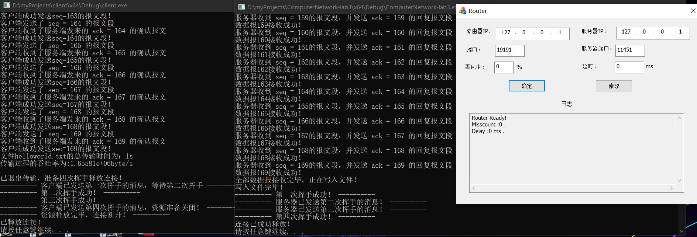

在 `server.exe` 的同目录下成功收到了 `helloworld.txt` 文件，并且可以打开且字节数一致：

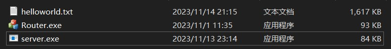

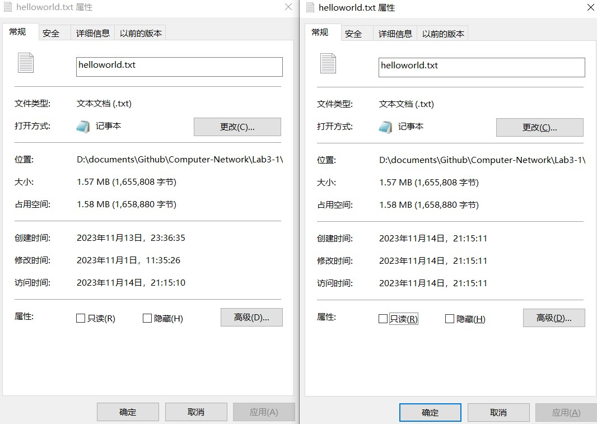

传输其他文件也同样可以成功，这说明我们的基本传输功能实现无误。

2.设置丢包率和延迟：以丢包率为10%，延时为10ms，传输`1.jpg`为例，结果如下：

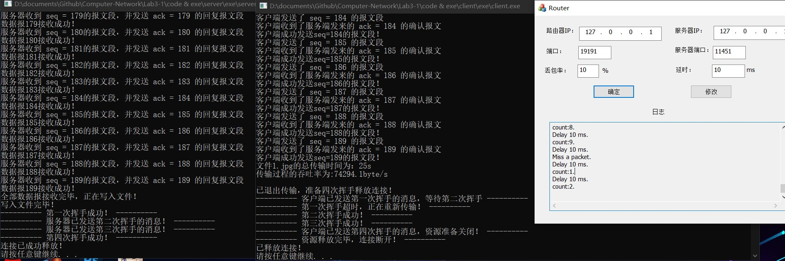

可以看到，由于丢包和延时，传输时间明显变长，吞吐率明显降低，但不影响传输后的效果：

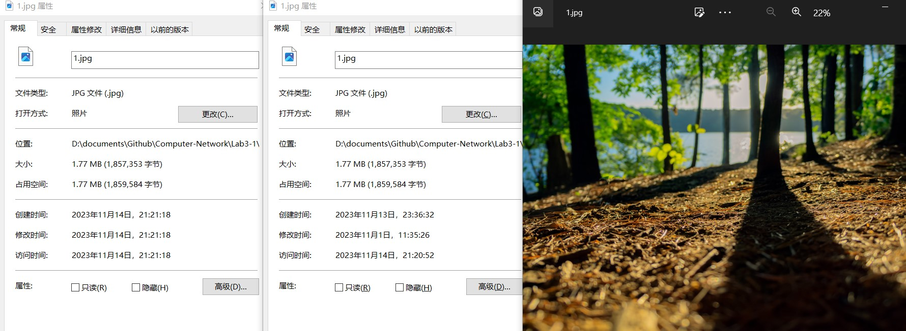

3.观察重传信息：当客户端超时未收到ACK时，会重传报文：

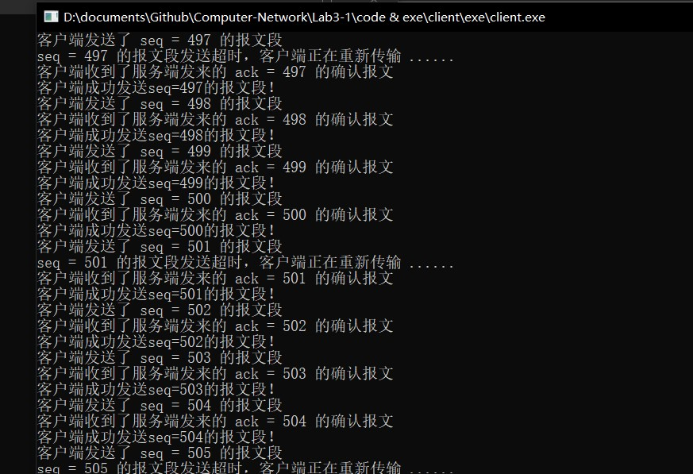

> 注：这里是传输 `2.jpg`，丢失率为20%

再观察服务端收到的信息，服务端收到的报文经过我们的设计处理都是有序的：

<div>
    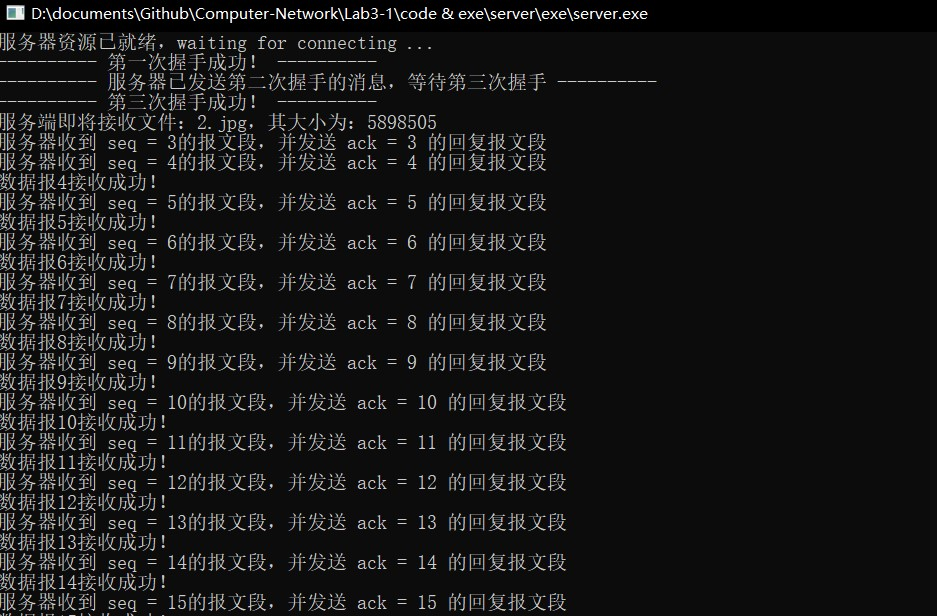
    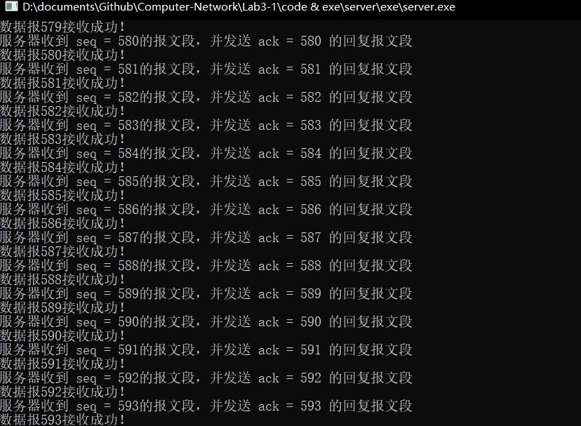
</div>


更多的测试不在此过多赘述，我们可以得到结论：成功完成了单向可靠文件传输，并在设计过程中，正确实现了**建立连接、差错检测、接收确认、超时重传、释放连接、重复报文段丢弃等功能，并且显示了传输时间和吞吐率**，详情请看上述报告及代码注释。

4.图形结果展示：以传输 `1.jpg` 文件为例进行多次实验，传输时间、吞吐率与丢包率的关系图如下：

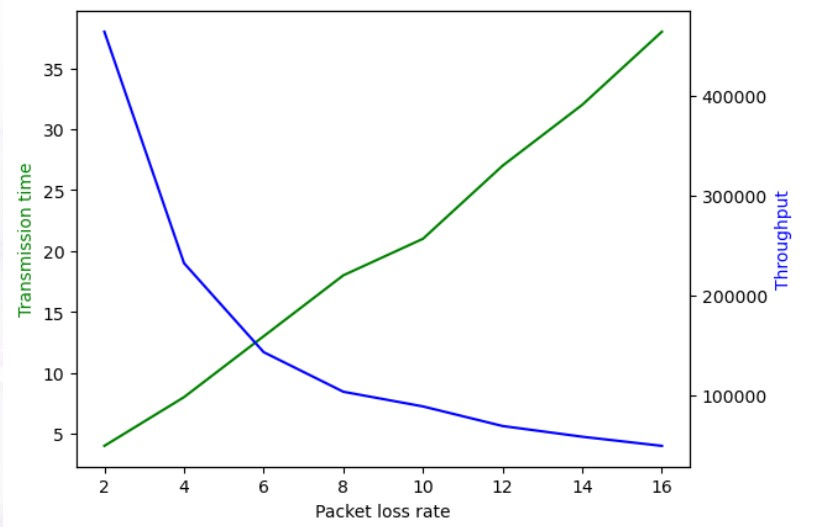

可以看到，随着丢包率的提升，传输时间不断上升，吞吐率不断下降，由于我们传输的文件较小，因此在不丢包的情况下传输时间很短，所以在设置丢包率后，传输时间几乎以一条直线上升；而吞吐率是文件大小/传输时间，文件大小不变，因此曲线是一个反比例函数增长。

当设置延迟时，只会将上图这两条曲线进行平移，而不会改变趋势，在此不多赘述。

5.**如何使用**：

- 首先打开路由器，IP都设为回环地址，路由IP为19191，服务IP为11451
- 接着在服务端中输入1-4，分别表示传输三张对应图片和 `helloworld.txt`
- 传输完成后，文件将存于 `server.exe` 的同级目录下

#### 四、实验遇到的问题

1.设置丢包后，客户端无法继续传输：原因是套接字进入了阻塞状态，解决方法：

```c
unsigned long on = 1;
ioctlsocket(clientSocket, FIONBIO, &on);
```

就是通过 `FIONBIO` 标志设置套接字为非阻塞模式

2.`visual studio 2019` 及以上版本，使用 `fopen,fwrite` 等函数会报警告而编译失败的问题：

解决方法：在项目 $\to$ 属性 $\to$ C/C++ 的预处理器中，添加：**_CRT_SECURE_NO_WARNINGS** 

3.如何在差错检测中实现两两16位数相加：

C语言中的结构体在内存中是连续排列的，然而由于编译器的某些优化，可能会使得结构体不连续，因此我们要加一个 `#pragma pack(1)`，禁用编译器的这种非对齐优化。

然后，利用一个类型转换，将数据视为一个16位的数组，后续遍历这个数组，每两个16位数进行求和：

```c
unsigned short* dataAs16bit = (unsigned short*)this;
```

