<h2 style="text-align:center"> 计算机网络第四次实验报告

<h4 style="float:right">姓名：曹珉浩&emsp;&emsp;学号：2113619

[toc]

> Lab3：基于UDP服务设计可靠传输协议并编程实现
>
> 3-2 具体要求：在实验3-1的基础上，将停等机制改成基于滑动窗口的流量控制机制，发送窗口和接收窗口采用相同大小，支持累积确认，完成给定测试文件的传输

#### 一、协议设计

##### 1.1 数据报设计

数据报结构体 `Message` 沿用实验3-1的设置未变，格式如下所示，不再赘述

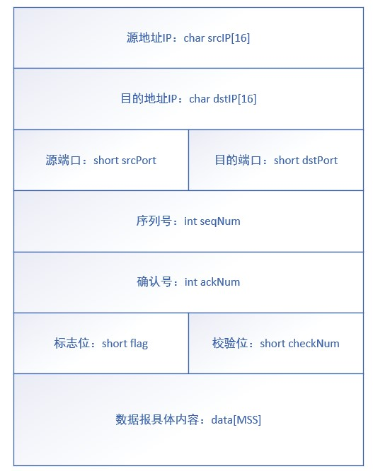

##### 1.2 连接建立与释放

在本次实验中，连接建立与释放也沿用实验3-1的设置，即仿照TCP实现的三次握手与四次挥手

**三次握手实现：**

- 第一次握手：客户端向服务端发起请求，**携带初始序列号 `seq = x`**，并且需要把 **SYN** 标志位置位，表示建立连接。服务端接收到数据报后，需要检验校验和，**SYN标志位**和序列号，如果发生错误则连接建立失败。
- 第二次握手：服务端向客户端回复请求，携带初始序列号 `seq = x`，然后把 **ACK 和 SYN 标志位置位**，表示响应和建立连接。同样，客户端接收到服务端的数据报也需要检查。
- 第三次握手：客户端向服务端最终确认，这次客户端只需要将 **ACK置位**

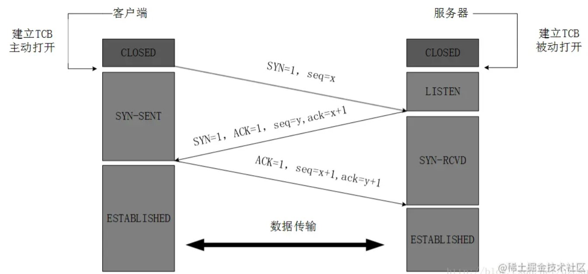

**四次挥手实现：**

- 第一次挥手：客户端向服务端发送释放连接请求，并且需要把 **FIN** 置位，表示释放连接，服务端需要检验 FIN 标志，序列号以及校验和，如果正确则第一次挥手成功，客户端**自此不再向服务端发送任何数据**，进入 **FIN-WAIT1状态**
- 第二次挥手：服务端回应客户端，发出确认报文，ACK 置位，进入 **CLOSE-WAIT** 状态，然后客户端进行 ACK、序列号、校验和检查，无误则第二次挥手成功，客户端进入 **FIN-WAIT2状态**，等待释放连接报文
- 第三次挥手：仍然是服务端向客户端，但这次是**释放连接报文**，**需要把 ACK 和 FIN 都置位**，此时，服务器进入 **LAST-ACK**（最后确认）状态，等待客户端的检查和确认
- 第四次挥手：检查无误后，客户端向服务端最终确认，发送完毕之后还要等待 **2*MSL**，避免报文未到达

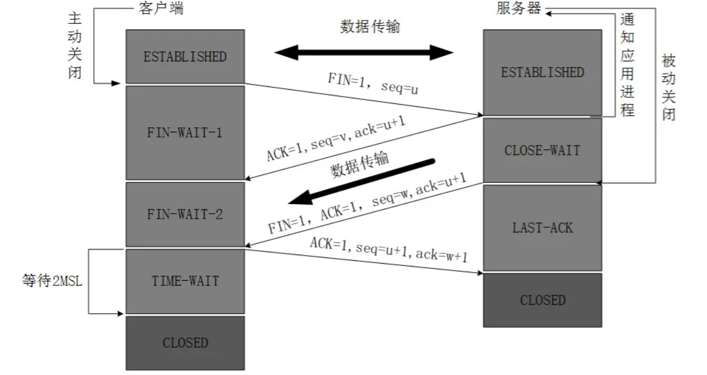

和上次实验一样，报文段在传输过程中可能存在**丢失和乱序**现象，当出现乱序现象时，解决方法和实验3-1停等机制一致，即通过**检查序列号**；而出现丢失现象时，由于本次实验为滑动窗口机制，我们要**重传基序号到 `nextseqnum` 之间所有的报文段**，具体做法和代码实现将在后续给出。

##### 1.3 **GoBackN** 与数据发送

在rdt3.0以前，使用我们上次实验所用到的**停等机制**，当一个数据报未得到接收方确认时，发送方不能发送下一个数据报，因此存在很严重的效率问题。在rdt3.0以后，实现了**流水线优化**。其中，本次实验的GoBackN就是一种典型的流水线协议。在 GBN 协议中，**允许发送方发送多个分组而不需等待确认**，分组的大小即本次实验的滑动窗口大小N，示意图如下：


其中，**基序号**定义为最早的未被确认的序列号，`nextseqnum` 则指向下一个待发分组的序列号。可以看到，这两个序号和窗口结束的位置把整体的序号空间分为四份：

- 在基序号以前，对应于已经发送并得到确认的分组，它们无需再做任何操作
- 在基序号和`nextseqnum`之间，**对应已发送但未收到确认的分组**，这也是GBN算法能够提升效率的根本所在，相较于停等机制，GBN算法在未收到确认之间可以继续发送一些报文段
- 在`nextseqnum`和窗口结束位置之间，即 `base` 和 `base+N` 之间，是可以发送但还未发送的报文分组
- 在窗口结束位置之外，是不可发送的分组

基于如上的 GBN 传输流程，**定义我们本次实验的传输逻辑如下：**

- 初始时，将基序号和 `nextseqnum` 都置为0，接着不断传输数据报，每次传输后，将 `nextseqnum` 右移，直至达到窗口边界(`base+N`)或者全部数据报传输完毕

##### 1.4 **超时重传与快速重传算法**

在实验3-1的停等机制设计时我们知道，服务端发来的ACK代表它接收的最大有序报文段的序号值，这个值加1就是服务端所期待的下一个报文段的序号，当客户端发来的报文段的序列号不是 `ack+1` 的时候，就一直拒绝接收直到客户端发来正确的报文段。

而在本次的累计确认机制中，客户端在未收到客户端ACK时可以再发送一些报文段，而产生丢失的时候，服务端会发来很多重复的ACK，标识着它接收的最大有序报文段的序号值。客户端并不知道具体丢失的是哪个数据报，因为他已经发送了 [base,nextseqnum] 之间这么多的报文段，**因此，在累计确认机制中，当产生丢失时我们要重发 [base,nextseqnum] 之间所有的报文段**，具体的代码实现将于后续给出。

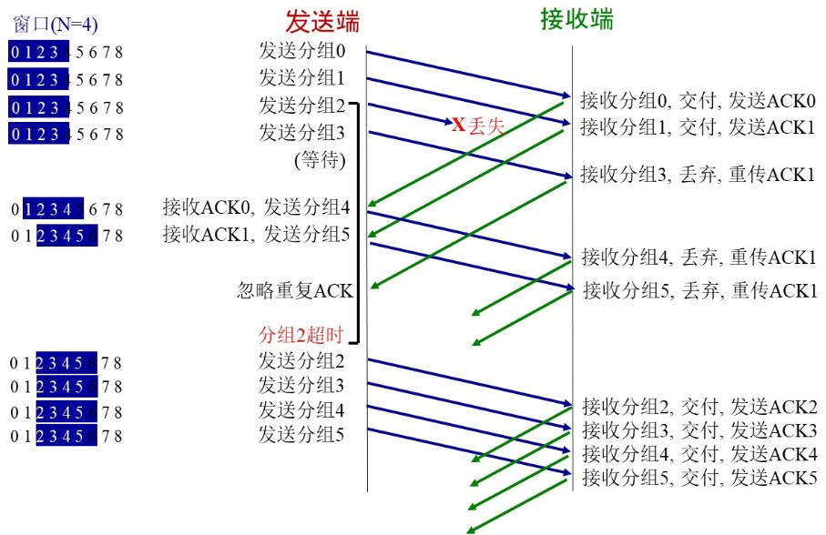

此外，在本次实验中，我们还实现了**快速重传**。从上面的逻辑中我们可以看出，当产生丢失现象时，客户端会收到服务端发来的很多重复的ACK，**快速重传机制就是指：当发送端收到三次连续重复的相同ACK时，就可以认为产生了丢失，立即重传 [base,nextseqnum] 之间所有的报文段，而不用等待超时时间到达**，代码实现同样在后续过程中给出。

##### 1.5 数据接收(累计确认)

服务端的数据接收逻辑未改，仍然是顺序接收报文段。在本小节中主要介绍客户端的数据接收逻辑：

在上次实验的停等机制中，客户端发送一个数据报后，会一直等待服务端发来的ACK，如果在一段时间内都没有收到，就会进行超时重传。我们可以看到，**在停等机制中，客户端发去的 `seq` 和服务端返回的 `ack` 是交替并且一一对应的**。但在累计确认的实现中，客户端允许在未收到ACK时继续发送一些报文段，客户端不知道什么时候会收到一个ACK，也不知道会收到几个连续ACK，因此它们在一段时间内并不是一一对应的(即 `seq` 的值应该比收到的 `ack` 多“发送还未被确认”的报文数量)，我们不能像上次实验那样简单地把一次收发定义为一个过程。

在本次实验中，我们所解决的方法是**采用多线程的方式：定义一个线程不断接收服务端发来的ACK，而主线程则用于不断发送数据报。**并且每收到一个ACK，就把 `base` 右移，表示最大已确认报文数+1，窗口右移。

#### 二、程序设计

##### 2.1 报文格式与全局变量

数据报结构体并未更改，其具体格式如下，结构体函数也未进行添加或删除，包含设置校验和，求校验和，设置端口和几个标志位等。

```c
struct Message
{
	// 数据报首部
	char srcIP[16], dstIP[16];
	unsigned short srcPort, dstPort;
	unsigned int seqNum; //序列号 seq
	unsigned int ackNum; //确认号 ack
	unsigned int size; //数据大小
	unsigned short flag; //标志位
	unsigned short checkNum; //校验位

	// 数据报内容，字节流报文
	char data[MSS];

	Message();
	bool getCheck(); // 求校验和，如果结果的16位整数全为1则返回true
	void setCheck(); // 将数据报补齐为16的整数倍，并且按位取反求和放入校验位
	void setPort(unsigned short src, unsigned short dst); // 设置源端口和目的端口
	void set_SYN() { flag += SYN; }
	void set_ACK() { flag += ACK; }
	void set_FIN() { flag += FIN; }
};
```

在本次实验中，除了3-1使用的若干常量外，还添加了以下全局变量：

```c++
int window_start = 0; // 滑动窗口的开始位置，即基序号
int next_send = 0; // 指向下一个要发送的序列号
bool isEnd = 0; // 判断是否接收完毕
bool quickSend = 0; // 三次重复ACK快速重传标志
clock_t msgTime = 0; // 报文分组重传时间
int WINDOW_SIZE = 10; // 滑动窗口大小，支持在开启exe时更改
std::mutex mtx; // 互斥锁对象，让控制台输出有序
```

##### 2.2 客户端ACK接收(累计确认)与快速重传算法实现

如1.5小节所分析，客户端的数据接收是一个线程，代码如下：

```c
DWORD WINAPI recvThread(PVOID lpParam)
{
	int* pointer = (int*)lpParam;
	int sum = *pointer; // 得到总的消息数量
	int recv_ack = -1; // 记录收到的ACK
	int count = 0;
	while (true) {
		Message recvMessage;
		int bytes = recvfrom(clientSocket, (char*)&recvMessage, sizeof(recvMessage),
                             0, (SOCKADDR*)&serverAddr, &addrLen);
		if (bytes > 0 && recvMessage.getCheck()) {
			// 收到服务端传来的ACK，则窗口右移
			if (recvMessage.ackNum >= window_start)
				window_start = recvMessage.ackNum + 1;
			// 能收到客户端发来的ACK，证明未超时，时钟重置
			if (window_start != next_send)
				msgTime = clock();
			{
                // 加入互斥锁，使控制台打印有序
				std::lock_guard<std::mutex> lock(mtx);
				std::cout << "客户端收到了服务端发来的 ack = " << recvMessage.ackNum << " 的确认报文" << endl;
				std::cout << "【滑动窗口信息打印】窗口大小：" << WINDOW_SIZE << "，目前存在已发送但未收到ACK的报文段数量：" << next_send - window_start << "，还未发送的报文段数量：" << WINDOW_SIZE - (next_send - window_start) << endl;
			}
			if (recvMessage.ackNum == sum - 1) {
				std::cout << "客户端接收完毕！" << endl;
				isEnd = true;
				return 0;
			}
			// 记录当前ACK，如果下一次还是这个ACK就计数
			if (recv_ack != recvMessage.ackNum) {
				recv_ack = recvMessage.ackNum;
				count = 0;
			}
			else count++;
			if (count == 3) quickSend = true;
		}
	}
	return 0;
} 
```

这里采用一个循环来不断接收ACK，客户端在开启这个线程之前会根据文件大小计算报文段的总数量，然后作为参数传递给这个线程，当收到这么多个ACK时，就代表数据传输完毕，循环就可以退出，线程结束。

然后注意滑动窗口机制和超时重传策略的实现：客户端收到服务端传来的ACK，则窗口右移(`window_start = recvMessage.ackNum + 1`)；以及如果客户端能够收到服务端发来的ACK，证明未超时，那么将全局的时钟重置。

最后注意快速重传算法的实现：在进入循环之前，我们定义了 `recv_ack` 用于记录上一次收到的ACK，在每次收到ACK时判断这次收到的ACK是不是 `recv_ack`，如果不是证明收到了不同的ACK，滑动窗口正在右移，如果是的话证明客户端开始收到了重复的ACK，我们就开始计数，**当计数器到3的时候证明收到了三次重复ACK，我们就把 `quicksend` 标志位置位，让主线程的发送函数立即发送 [base,nextseqnum] 之间所有的报文段，而无需等待超时。**

##### 2.3 数据传输与超时重传

我们将传输一整个文件的过程全部封装在下面这个函数中，即如协议设计中所说，主线程用于不断发送报文段，并另开一个线程不断接收服务端发来的ACK，并当整个过程结束时输出传输时间和吞吐率，代码如下：

```c
bool sendFile(string fileName)
{
	int startTime = clock();
	ifstream fin(fileName.c_str(), ifstream::binary); // 以字节流打开传入文件
	BYTE* transFile = new BYTE[LONGEST];
	unsigned int fileSize = 0;
	BYTE currByte = fin.get();
	while (fin) {
		transFile[fileSize++] = currByte;
		currByte = fin.get();
	}
	fin.close();

	// 计算段长度和总报文端数量：
	int segments = fileSize / MSS;
	int leftBytes = fileSize % MSS;
	int sum = leftBytes > 0 ? segments + 2 : segments + 1; // 文件信息也要占一个报文段

	// 创建接收服务端ack消息的线程：
	HANDLE ackThread = CreateThread(NULL, 0, (LPTHREAD_START_ROUTINE)recvThread, &sum, 0, 0);

	// 主线程用于不断发送报文段
	while (true) {
		// 滑动窗口大小N：未收到ACK也可以继续发送一些数据
		if (next_send < window_start + WINDOW_SIZE && next_send < sum) {
			Message sendMessage;
			sendMessage.setPort(CLIENT_PORT, SERVER_PORT);
			if (next_send == 0) { // 即开始的时候，先发送文件信息
				sendMessage.size = fileSize;
				sendMessage.seqNum = next_send;
				for (int i = 0; i < fileName.size(); i++)//填充报文数据段
					sendMessage.data[i] = fileName[i];
				sendMessage.data[fileName.size()] = '\0';
				sendMessage.setCheck();
			}
			// 即结尾的时候，处理不满一个报文段的数据
			else if (next_send == segments + 1 && leftBytes> 0) {
				sendMessage.seqNum = next_send;
				for (int j = 0; j < leftBytes; j++) 
					sendMessage.data[j] = transFile[segments * MSS + j];
				sendMessage.setCheck();
			}
			else { // 中间正常的报文段
				sendMessage.seqNum = next_send;
				for (int j = 0; j < MSS; j++)
					sendMessage.data[j] = transFile[(next_send - 1) * MSS + j];
				sendMessage.setCheck();
			}
			{
				std::lock_guard<std::mutex> lock(mtx);
				sendto(clientSocket, (char*)&sendMessage, sizeof(sendMessage), 0, (SOCKADDR*)&serverAddr, addrLen);
				std::cout << "客户端已发送 seq = " << sendMessage.seqNum << " 的报文段！" << endl;
				// 某个滑动窗口初始化时开始计时
				if (window_start == next_send)
					msgTime = clock();
				// 发送一个报文段，next_send 后移
				next_send++;
				std::cout << "【滑动窗口信息打印】窗口大小：" << WINDOW_SIZE << "，目前存在已发送但未收到ACK的报文段数量：" << next_send - window_start << "，还未发送的报文段数量：" << WINDOW_SIZE - (next_send - window_start) << endl;
			}
		}
		// 当前滑动窗口超时或者收到服务端三次重复ACK时，把[window_start,next_send]区间内报文全部重传
		if (clock() - msgTime >= MAX_WAIT_TIME || quickSend == true) {
			Message sendMessage;
			sendMessage.setPort(CLIENT_PORT, SERVER_PORT);
			// 重传[window_start,next_send]区间内的全部报文
			for (int i = 0; i < next_send - window_start; i++) {
				if (window_start == 0) { // 文件信息报文端丢失
					sendMessage.size = fileSize;
					sendMessage.seqNum = 0;
					for (int j = 0; j < fileName.size(); j++)//填充报文数据段
						sendMessage.data[j] = fileName[j];
					sendMessage.data[fileName.size()] = '\0';
					sendMessage.setCheck();
				}
				// 最后一个残缺的报文段缺失
				else if (window_start + i == segments + 1 && leftBytes > 0) {
					sendMessage.seqNum = segments + 1;
					for (int j = 0; j < leftBytes; j++)
						sendMessage.data[j] = transFile[segments * MSS + j];
					sendMessage.setCheck();
				}
				else {
					sendMessage.seqNum = window_start + i;
					for (int j = 0; j < MSS; j++)
						sendMessage.data[j] = transFile[(window_start + i - 1) * MSS + j];
					sendMessage.setCheck();
				}
				sendto(clientSocket, (char*)&sendMessage, sizeof(sendMessage), 0, (SOCKADDR*)&serverAddr, addrLen);
				std::cout << "客户端已【重新发送超时的报文段】 seq = " << sendMessage.seqNum << endl;
			}
			msgTime = clock(); //重新计时
			quickSend = false;
		}
		if (isEnd) break;
	}
	CloseHandle(ackThread);
	clock_t endTime = clock();
	std::cout << "文件" << fileName << "的总传输时间为：" << (endTime - startTime) / CLOCKS_PER_SEC << "s" << endl;
	std::cout << "传输过程的吞吐率为:" << ((float)fileSize) / ((endTime - startTime) / CLOCKS_PER_SEC) << "byte/s" << endl << endl;
	return true;
}
```

**首先注意我们的滑动窗口机制实现**：当还有可用序号(即`next_send < window_start + WINDOW_SIZE`)并且传输过程未结束时，即使未收到ACK，客户端也可以继续发送，当另外一个线程收到ACK时，基序号也会右移，这就是整个滑动窗口的逻辑实现。

然后注意超时重传的实现：当**超过最大等待时间或者快速重传标志位置位的时候**，我们就要把 [window_start,next_send] 区间内报文全部重传，然后重置时钟。

##### 2.4 其他

三次握手建立连接过程、四次挥手释放连接过程、以及服务端的接收逻辑都未进行更改，在此不赘述代码，可以参考文末仓库链接或者上一次的实验报告。

#### 三、程序演示 & 结果分析

##### 3.1 使用方法 & 程序演示

设置好端口、丢包率和延时后，先打开`server.exe`，再打开 `client.exe`，建立连接后在客户端中会提醒输入滑动窗口的大小，然后选择要传输的文件，1-4分别代表传输三个对应图片以及txt文档，下面以丢包率为5%，延时为5ms，窗口大小为10，传输`1.jpg`为例进行演示，观察程序的输出，如下所示：

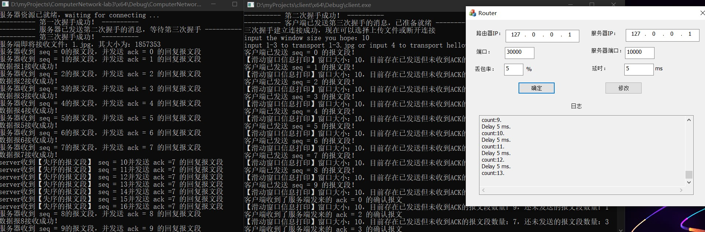

在客户端中，有足够多的**滑动窗口信息打印**：

<div>
    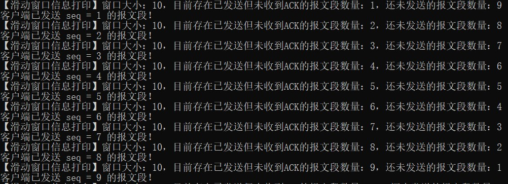
    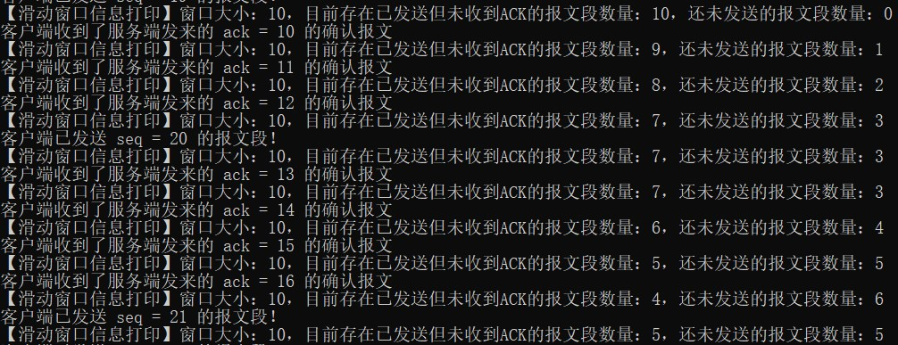
</div>


可以看到，客户端发送一个seq，`next_send` 就右移，因此已发送未收到ACK的报文数量就增加，可用但还未发送的报文就减少；当客户端收到一个ack时，窗口开始位置就右移，因此因此已发送未收到ACK的报文数量就减少，可用但还未发送的报文就增多。因此我们的滑动窗口机制与累积确认机制都实现无误，并且由于加入了互斥锁的原因，控制台的输出都是有序的。

**超时重传与快速重传信息打印：**

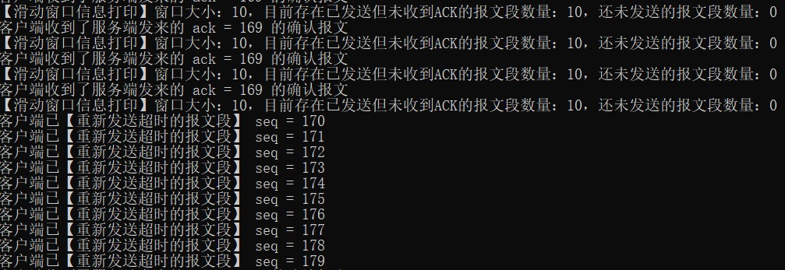

可以看到，客户端收到了服务端发来的三次重复ACK，并且此时可用报文为0，即 [base,nextseqnum] 包含了整个窗口，因此进行了重传，可以看到，对这个区间内的所有报文都重传了。

**传输时间与吞吐率打印：**


**服务端信息打印**，和上次基本一致，也可以看到收到的 `seq` 都是顺序的：

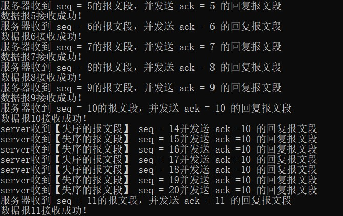

**传输结果**，图片可以正常打开，再次传输文本文档，也可以正常打开：

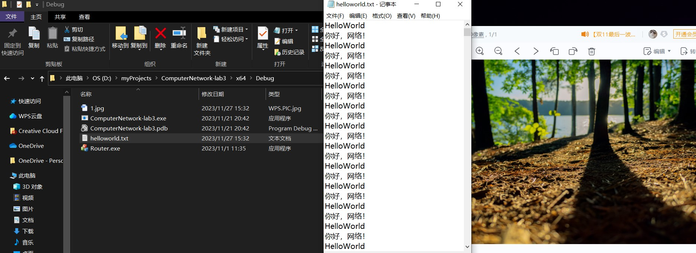

##### 3.2 结果分析

我们统一丢包率为10%，延时为10ms，然后不断调整窗口大小，得到的四个文件的传输结果如下：

|                |      1.jpg      |      2.jpg      |      3.jpg      | helloworld.txt  |
| :------------: | :-------------: | :-------------: | :-------------: | :-------------: |
| 传输时间(N=10) |      25 s       |      79 s       |      165 s      |      22 s       |
|  吞吐率(N=10)  |  74294.1byte/s  | 74664.0 byte/s  | 72539.4 byte/s  | 75264.0 bytes/s |
| 传输时间(N=15) |      24 s       |      76 s       |      159 s      |      21 s       |
|  吞吐率(N=15)  | 77389.7 byte/s  | 77661.2 byte/s  | 75276.7 byte/s  | 78848.0 byte/s  |
| 传输时间(N=20) |      23 s       |      75 s       |      157 s      |      21 s       |
|  吞吐率(N=20)  | 80754.5 bytes/s | 78696.5 bytes/s | 76226.5 bytes/s | 78848.0 byte/s  |

可以看到，**随着滑动窗口大小的增加，即流水线并行化程度增加，四个文件的传输时间均有所减少，吞吐率均有所增加**，然而随着进一步增大窗口大小，会出现传输时间优化不明显，甚至更长的现象。究其原因，是因为我们为每个包设置了延时，滑动窗口机制的重传需要把 [base,nextseqnum] 区间内的所有报文段重传，这个代价过于昂贵。当不设置延时时，吞吐率随窗口大小的增加更为明显，这部分的更详细测试将在3-4中给出，下面是如上表格的图形化展示：

<div>
    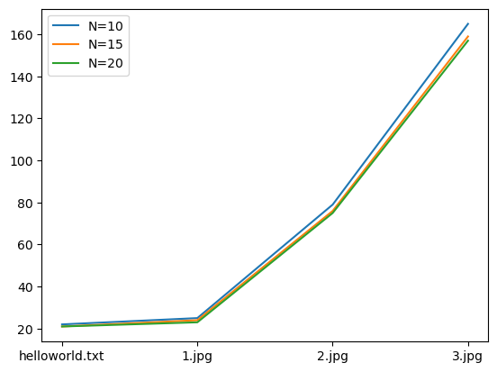
    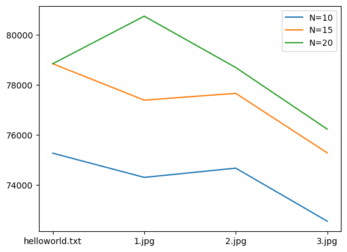
</div>


在这里我们简单地与停等机制做一下对比，依然是丢包率为10%，延时为10ms：

|          |     1.jpg      |     2.jpg      |     3.jpg      | helloworld.txt  |
| :------: | :------------: | :------------: | :------------: | :-------------: |
| 传输时间 |      27 s      |      87 s      |     172 s      |      25 s       |
|  吞吐率  | 68790.8 byte/s | 67798.9 byte/s | 69587.2 byte/s | 66232.3 bytes/s |

可以看到，滑动窗口机制对比停等机制，有一定程度上的效率提升。当延时进一步降低时，这个提升会更加明显，二者更加详细的对比也将在实验3-4中继续进行。

#### 四、遇到的问题

1.在实验过程中比较粗心，客户端发送报文段时，忘记把next++，导致后续传输的报文段总是上一个报文段的值，虽然结果能够打开，但会出现乱码，仅仅少了这一行代码就找了一个多小时

2.想利用实验3-1实现的 `sendsegment` 函数，但发现不合GBN的逻辑，原因就是如前面所说的seq和ack在一段时间内不对等的情况。解决方法是弃用这个函数，转用多线程的方法实现

3.当失序的报文传来时，若此时让 `window_start = recvMessage.ackNum+1`，会导致窗口出现左移的情况，解决方法是加入判断 `ackNum >= window_start`，判断它落在窗口内部，然后再让窗口右移


仓库链接：[Github](https://github.com/MrGuaB1/Computer-Network)   将在ddl之后开放为public

有关上一次实验的具体设计，请参考 [Lab3-1报告](https://github.com/MrGuaB1/Computer-Network/tree/main/Lab3-1/report)