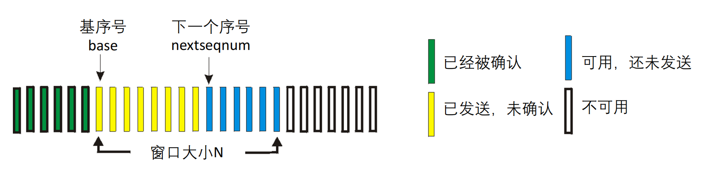

<h2 style="text-align:center"> 计算机网络第四次实验报告

<h4 style="float:right">姓名：曹珉浩&emsp;&emsp;学号：2113619

[toc]

> Lab3：基于UDP服务设计可靠传输协议并编程实现
>
> 3-2 具体要求：在实验3-1的基础上，将停等机制改成基于滑动窗口的流量控制机制，发送窗口和接收窗口采用相同大小，支持累积确认，完成给定测试文件的传输

#### 一、协议设计

##### 1.1 GoBackN

在rdt3.0以前，使用我们上次实验所用到的**停等机制**，当一个数据报未得到接收方确认时，发送方不能发送下一个数据报，因此存在很严重的效率问题。在rdt3.0以后，实现了流水线优化。其中，本次实验的GoBackN就是一种典型的流水线协议。在 GBN 协议中，**允许发送方发送多个分组而不需等待确认**，分组的大小即本次实验的滑动窗口大小N，示意图如下：

其中，**基序号**定义为最早的未被确认的序列号，`nextseqnum` 则指向下一个待发分组的序列号。可以看到，这两个序号和窗口结束的位置把整体的序号空间分为四份：

- 在基序号以前，对应于已经发送并得到确认的分组，它们无需再做任何操作
- 在基序号和`nextseqnum`之间，**对应已发送但未收到确认的分组**，这也是GBN算法能够提升效率的根本所在，相较于停等机制，GBN算法在未收到确认之间可以继续发送一些报文段
- 在`nextseqnum`和窗口结束位置之间，即 `base` 和 `base+N` 之间，是可以发送但还未发送的报文分组
- 在窗口结束位置之外，是不可发送的分组