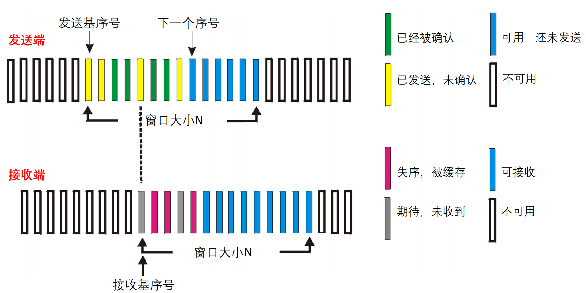
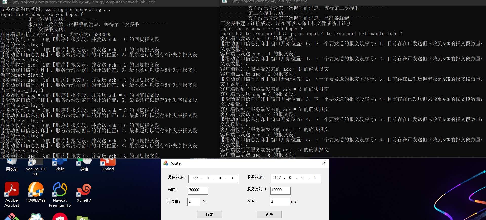
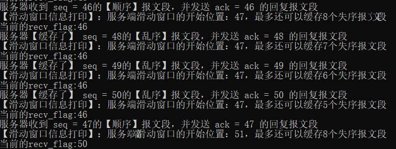
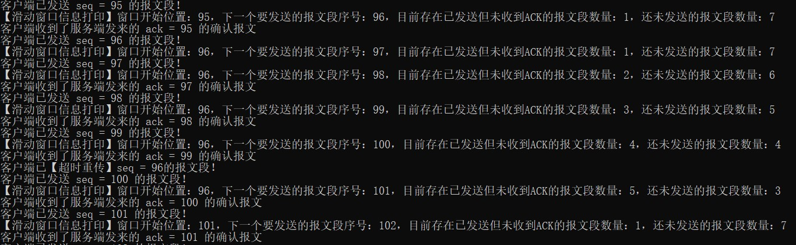
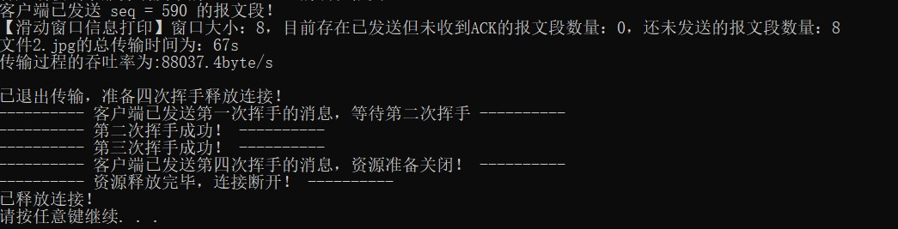
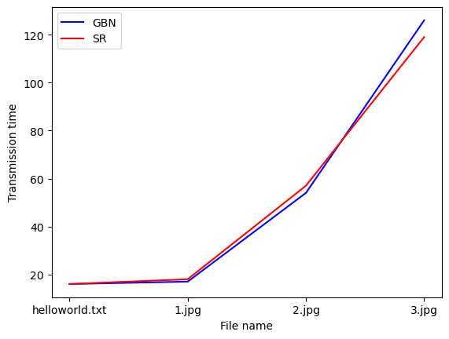
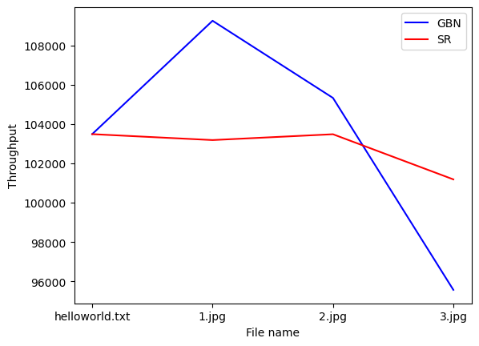
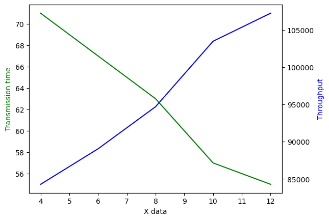

<h2 style="text-align:center"> 计算机网络第五次实验报告

<h4 style="float:right">姓名：曹珉浩&emsp;&emsp;学号：2113619

[toc]

> Lab3：基于UDP服务设计可靠传输协议并编程实现
>
> 3-3 具体要求：在实验3-1的基础上，将停等机制改成基于滑动窗口的流量控制机制，发送窗口和接收窗口采用相同大小，支持选择确认，完成给定测试文件的传输

#### 一、协议设计

##### 1.1 数据报设计

我们在实验3-1和3-2的数据报结构体之上，添加了两个字段：**接收窗口通告和接收窗口开始位置**，接收窗口通告字段的作用是告诉发送端，接收端还可以**最多缓存几个乱序报文段**；而接收窗口开始位置则是客户端最大已接受有序报文段序号的下一个序号，由于我们本次是基于(很)多线程实现的，难免会有一些信息不能及时沟通，这个字段的作用是进行**客户端的窗口开始位置检测**，因为服务端的窗口开始位置之前都已经确认完毕，如果这个字段的值比客户端的接收窗口开始位置还大，就说明有若干线程没有即使更新，利用这个字段及时改变客户端的窗口位置。

这两个字段的更新和使用方法将在代码实现中进一步说明，更新后的数据报示意图如下：


##### 1.2 连接建立与释放

在本次实验中，连接建立与释放继续沿用实验3-1的设置，即仿照TCP实现的三次握手与四次挥手

##### 1.3 选择确认

在上次实验的累积确认中我们看到，接收端的逻辑并未进行多少更改，仍然是类似于停等机制的策略，如果发送端发来的下一个报文段不是所期待的就拒绝接收，并回复期待的ACK，发送端在超时或收到三次重复ACK时(即上次实验中实现的快速重传算法)，就会重新发送[base,nextseqnum] 区间内的**所有报文**。如果丢包现象频繁发生，累积确认算法就会不停的发送区间内的所有报文，这会严重的影响效率。为此，rdt实现了另一种流水线算法，即本次实验中的选择确认。

在选择确认中，接收端的逻辑进行了一定程度上的修改：**接收端会独立确认每个正确接收的分组，并缓存乱序分组，并且每个分组独立定时**，基于接收端的收发逻辑，**发送端只重传未收到ACK的分组即可**，而不用像GBN一样需要发送很多，可以看到，选择确认以牺牲一些接收端的存储空间为代价，换来了传输速率的提升。



##### 1.4 数据发送

基于如上的选择确认思想，我们可以发现，每个数据报的发送、确认以及接收端的返回，都是相对独立的，它们之间互不干扰，只是受服务端发送窗口大小和接收端接收窗口大小的限制而已。既然如此，发送这个逻辑就很适合**多线程**进行实现，不同线程发送不同的数据报，这样就可以做到互不干扰，当收到服务端发来的对应的ACK时，线程本次的任务就结束。

因此我们定义本次实验服务端的发送逻辑如下：发送端对每一个数据报的发送建立一个线程，线程的工作是发送指定的顺序数据报，并等待接收服务端发来的ACK，如果超出等待时间，那么重传数据报，**线程当收到服务端发来的ACK时结束工作，并释放资源。**同时，客户端应该总是维护活跃的线程数 < 窗口大小，并在每新建一个线程后隔一段时间(`sleep`若干毫秒)再创建新的线程(如果满足条件的话)，**以确保客户端发出的报文段有序，并且始终不会超出窗口大小。**

> 总结选择确认中允许客户端发送数据报的条件：
>
> - `nextseqnum < base + N`：和停等机制一样，不能超出客户端的发送滑动窗口
> - `server_available > 0`：解析数据报中的接收窗口通告，获取服务端最多还可缓存多少报文
> - `vaild_thread < WINDOW_SIZE`：活跃线程数小于窗口大小，确保不会发送窗口范围外的报文

此外，由于第一个数据报(发送文件相关信息)和最后一个数据报(未满MSS数据报)比较特殊，我们并没有把这两个报文段放到并行过程中，而是首先主线程发送第一个数据报，之后若干一次性线程并行处理中间报文段，最后主线程阻塞至所有线程报文段发送完毕，发送最后一个未满报文段(如果有的话)，架构图如下所示：


##### 1.5 数据接收

如上所述，本次实验中接收端的逻辑也要做一定的调整，不能像停等机制一样只等待期待的报文序号，**而是独立确认每个发送来的报文，无论是否有序。**对于顺序的报文段，滑动窗口不断向前移动；而对于乱序的报文段，滑动窗口的开始位置不动，并缓存失序的报文段。可以看到，接收端最多可以缓存失序报文段的数量，取决于接收端的滑动窗口大小，窗口越大，容错率就越大， 效率就会越好，当然这会牺牲用户的存储空间。**当失序报文填满了接收端的滑动窗口时，接收端就拒绝接收，直到收到最大有序序号的下一个序号对应的报文段。**

还需要特别注意一点：**当缓存了若干失序报文段后，接收到顺序报文段时，不能简单的将窗口开始位置移动一个单位，而应该不断向前探查，直到找到最大的有序序号。**

#### 二、程序设计

##### 2.1 报文格式与全局变量

如协议设计中所说，我们在数据报中添加了两个字段，一个代表**接收端窗口开始位置**，这是接收端最大已接收有序报文序号的下一个序号；另一个是**接收窗口通告**，代表接收端最多还可以缓存多少乱序报文，更新后的数据报结构体如下：

```c
struct Message
{
	// 数据报首部
	char srcIP[16], dstIP[16];
	unsigned short srcPort, dstPort;
	unsigned int seqNum; //序列号 seq
	unsigned int ackNum; //确认号 ack
	unsigned int size; //数据大小
	unsigned short flag; //标志位
	unsigned short checkNum; //校验位
	unsigned int recv_size; // 接收窗口通告
	unsigned int base; // 接收窗口开始位置

	// 数据报内容，字节流报文
	char data[MSS];

	Message();
	bool getCheck(); // 求校验和，如果结果的16位整数全为1则返回true
	void setCheck(); // 将数据报补齐为16的整数倍，并且按位取反求和放入校验位
	void setPort(unsigned short src, unsigned short dst); // 设置源端口和目的端口
	void set_SYN() { flag += SYN; }
	void set_ACK() { flag += ACK; }
	void set_FIN() { flag += FIN; }
	void set_size(int size) { recv_size = size; }
	void set_base(int base) { this->base = base; }
};
```

与此相对应，接收端在本次实验中增加了如下全局变量，以方便实现功能：

```c
int WINDOW_SIZE = 10; // 窗口大小，默认是10，可以通过main函数的输入进行更改
int recv_flag = -1; // 标记最大有序接收的报文段编号
int left_space = WINDOW_SIZE; // 剩余可缓存的报文段
bool isRecved[LONGEST / MSS]; // 标记接收了哪些报文段
int sum = 0; // 总的报文段数量，接收文件信息后计算得到
```

发送端增加了如下全局变量：

```c
bool isRecved[LONGEST / MSS]; // 标记哪些报文段已经得到了确认
int sum; // 记录总的报文段数量，选择发送哪一个文件后计算得到
int server_base = 0; // 接收端窗口开始位置，为 recv_flag+1
int server_available = WINDOW_SIZE; // 服务端可用空间
int vaild_thread = 0; // 最多同时工作的线程数，应该小于窗口大小
```

##### 2.2 服务端数据接收 & 选择确认

本次服务端的接收逻辑做了较大的修改，以支持独立接收不同的、可能乱序的报文段：

- 首先接收0号报文，即文件相关信息：

```c
// 开始文件传输，首先接收文件的总体信息：
Message fileMessage; // 文件信息传输
unsigned int fileSize; // 记录文件大小
char fileName[100] = { 0 };
while (true) {
	int bytes = recvfrom(serverSocket, (char*)&fileMessage, sizeof(fileMessage), 0, (sockaddr*)&clientAddr, &addrLen);
	if (bytes > 0) {
		// 成功收到消息，检查ACK和seq，然后向客户端回复一个ACK：
		if (fileMessage.getCheck() && fileMessage.seqNum == next) {
			next++;
			fileSize = fileMessage.size;
			for (int i = 0; fileMessage.data[i]; i++)
				fileName[i] = fileMessage.data[i];
			std::cout << "服务端即将接收文件：" << fileName << "，其大小为：" << fileSize << endl;
			recv_flag++;
			isRecved[fileMessage.seqNum] = true;
			Message ackMessage;
			ackMessage.setPort(SERVER_PORT, CLIENT_PORT);
			ackMessage.set_ACK(); //ACK置位表示响应
			ackMessage.ackNum = fileMessage.seqNum; // 回复的响应号就是接收的序列号
			ackMessage.setCheck(); // 设置校验和
			ackMessage.set_size(WINDOW_SIZE); // 设置接收窗口通告，初始时为窗口大小
			// 发送ACK报文
			sendto(serverSocket, (char*)&ackMessage, sizeof(ackMessage), 0, (sockaddr*)&clientAddr, addrLen);
			std::cout << "服务器收到 seq = " << fileMessage.seqNum << "的【顺序】报文段，并发送 ack = " << ackMessage.ackNum << " 的回复报文段" << endl;
			break;
		}
	}
}
```

- 然后接收文件主体部分，首先计算满的报文段数量 `segments` 以及是否还存在不满一个MSS的报文段，接着还是通过一个 `while(true)` 来不断监听，直到获取了 `segments` 这么多个报文。在接收过程中，**如果收到的报文段是有序的，那么向后检查，找到第一个false，即找到新的窗口开始位置，如果收到了乱序的报文段，那么要消耗一个可缓存数量，并且窗口不能发生移动，并计算此时的还可缓存报文段数量，将ACK回复报文设置对应字段返回给发送端**，具体代码和进一步注释如下：

```c
int segments = fileSize / MSS;
int leftBytes = fileSize % MSS;
sum = leftBytes > 0 ? segments : segments + 1;
char* transFile = new char[fileSize];
int count = 0;
while (true) {
	Message recvMessage;
	int bytes = recvfrom(serverSocket, (char*)&recvMessage, sizeof(recvMessage), 0, (sockaddr*)&clientAddr, &addrLen);
	if (bytes > 0) {
		if (recvMessage.getCheck()) { 
			std::cout << "当前的recv_flag:" << recv_flag << endl;
			// 如果收到的报文段是有序的，那么向后检查，找到第一个false，即找到新的窗口开始位置
			if (recvMessage.seqNum == recv_flag + 1) {
				isRecved[recvMessage.seqNum] = true;
				for (int j = recv_flag; j < segments+1; j++) {
					if (isRecved[j] == false) {
						recv_flag = j - 1;
						break;
					}
				}
			// 向客户端发送顺序接收信息
			Message ackMessage;
			ackMessage.setPort(SERVER_PORT, CLIENT_PORT);
			ackMessage.set_ACK(); 
			ackMessage.ackNum = recvMessage.seqNum;
			ackMessage.setCheck(); // 设置校验和
			ackMessage.set_base(recv_flag + 1);			
			// 窗口大小通告
            left_space = getAvailable(recv_flag + 1);
			ackMessage.set_size(left_space);
			// 发送ACK报文
			sendto(serverSocket, (char*)&ackMessage, sizeof(ackMessage), 0, (sockaddr*)&clientAddr, addrLen);
			std::cout << "服务器收到 seq = " << recvMessage.seqNum << "的【顺序】报文段，并发送 ack = " << ackMessage.ackNum << " 的回复报文段" << endl;
			std::cout << "【滑动窗口信息打印】：服务端滑动窗口的开始位置：" << recv_flag + 1 << "，最多还可以缓存" << left_space << "个失序报文段" << endl;
			for (int j = 0; j < MSS; j++) 
				transFile[(recvMessage.seqNum - 1) * MSS + j] = recvMessage.data[j];
		}
		// 如果收到了乱序的报文段，那么要消耗一个可缓存数量，并且窗口不能发生移动
		else {
				// 对发来的报文段进行缓存
				isRecved[recvMessage.seqNum] = true;
				// 向客户端发送乱序接收信息
				Message ackMessage;
				ackMessage.setPort(SERVER_PORT, CLIENT_PORT);
				ackMessage.set_ACK();
				ackMessage.ackNum = recvMessage.seqNum;
				ackMessage.setCheck(); // 设置校验和
				// 窗口大小通告
				left_space = getAvailable(recv_flag+1);
				ackMessage.set_base(recv_flag + 1);
				ackMessage.set_size(left_space);
				// 发送ACK报文
				sendto(serverSocket, (char*)&ackMessage, sizeof(ackMessage), 0, (sockaddr*)&clientAddr, addrLen);
				std::cout << "服务器【缓存了】 seq = " << recvMessage.seqNum << "的【乱序】报文段，并发送 ack = " << ackMessage.ackNum << " 的回复报文段" << endl;
				std::cout << "【滑动窗口信息打印】：服务端滑动窗口的开始位置：" << recv_flag + 1 << "，最多还可以缓存" << left_space << "个失序报文段" << endl;
				for (int j = 0; j < MSS; j++) 
					transFile[(recvMessage.seqNum - 1) * MSS + j] = recvMessage.data[j];
			}				
			count++;
			if (count == segments) break;
		}
	}
}
```

- 最后，如果有不满一个MSS的报文段，继续接收，这部分代码不涉及并行、乱序等现象，和前几次实验相同，在此不做赘述，如下所示：

```c
if (leftBytes != 0) {
	while (true) {
		Message recvMessage;
		int bytes = recvfrom(serverSocket, (char*)&recvMessage, sizeof(recvMessage), 0, (sockaddr*)&clientAddr, &addrLen);
		if (bytes > 0) {
			std::cout << "数据报" << recvMessage.seqNum << "接收成功！" << endl;
			isRecved[recvMessage.seqNum] = true;
			Message ackMessage;
			ackMessage.setPort(SERVER_PORT, CLIENT_PORT);
			ackMessage.set_ACK();
			ackMessage.ackNum = recvMessage.seqNum;
			ackMessage.setCheck();
			// 窗口大小通告
			ackMessage.set_size(left_space);
			// 发送ACK报文
			sendto(serverSocket, (char*)&ackMessage, sizeof(ackMessage), 0, (sockaddr*)&clientAddr, addrLen);
			for (int j = 0; j < leftBytes; j++)
				transFile[segments * MSS + j] = recvMessage.data[j];
			break;
		}
	}
}
```

##### 2.3 客户端数据发送及ACK接收 & 超时重传机制

如协议设计中的架构图所示，我们首先串行发送文件相关信息：

```c
// 计算段长度和总报文端数量：
int segments = fileSize / MSS;
int leftBytes = fileSize % MSS;
sum = leftBytes > 0 ? segments + 2 : segments + 1; // 文件信息也要占一个报文段
// 先发送文件信息
Message fileMessage;
fileMessage.setPort(CLIENT_PORT, SERVER_PORT);
fileMessage.size = fileSize;
fileMessage.seqNum = 0;
for(int i=0;i<fileName.size();i++)
	fileMessage.data[i] = fileName[i];
fileMessage.data[fileName.size()] = '\0';
fileMessage.setCheck();
sendto(clientSocket, (char*)&fileMessage, sizeof(fileMessage), 0, (SOCKADDR*)&serverAddr, addrLen);
next_send++;
std::cout << "客户端已发送 seq = " << fileMessage.seqNum << " 的报文段！" << endl;
std::cout << "【滑动窗口信息打印】窗口开始位置：" << window_start << "，下一个要发送的报文段序号：" << next_send << "，目前存在已发送但未收到ACK的报文段数量：" << next_send - window_start << "，还未发送的报文段数量：" << WINDOW_SIZE - (next_send - window_start) << endl;
	window_start++;
isRecved[0] = true;
```

接着，对每一个报文段，开启一个一次性的线程进行发送，当收到ACK时就结束线程回收资源，而超过等待时间未收到ACK时就要进行**超时重传**，首先来看线程的具体工作代码，如下所示：

```c
void sendSegment(Message& sendMessage)
{
	// 发送报文段，并开始计时
	sendto(clientSocket, (char*)&sendMessage, sizeof(sendMessage), 0, (sockaddr*)&serverAddr, addrLen);
	HANDLE resendThread = CreateThread(NULL, 0, resendCheck, &sendMessage.seqNum, 0, NULL);
	clock_t startTime = clock();
	{
		std::lock_guard<std::mutex> lock(mtx);
		std::cout << "客户端已发送 seq = " << sendMessage.seqNum << " 的报文段！" << endl;
		std::cout << "【滑动窗口信息打印】窗口开始位置：" << window_start << "，下一个要发送的报文段序号："<<next_send<<"，目前存在已发送但未收到ACK的报文段数量：" << next_send - window_start << "，还未发送的报文段数量：" << WINDOW_SIZE - (next_send - window_start) << endl;
	}
	Message recvMessage;
	while (check_flag == true) {
		int bytes = recvfrom(clientSocket, (char*)&recvMessage, sizeof(recvMessage), 0, (sockaddr*)&serverAddr, &addrLen);
		if (bytes > 0) {
			if (recvMessage.ackNum == sendMessage.seqNum) {
				{			
					server_available = recvMessage.recv_size;
					std::lock_guard<std::mutex> lock(mtx);
					isRecved[sendMessage.seqNum] = true;
					std::cout << "客户端收到了服务端发来的 ack = " << recvMessage.ackNum << " 的确认报文" << endl;						
					// 如果前面都已经有序了，那么滑动窗口进行移动
					if (sendMessage.seqNum == window_start) {
						for (int j = window_start; j < sum; j++) {
							if (isRecved[j] == false && isRecved[j-1] == true)
								window_start = j;						
						}
					}
					server_base = recvMessage.base;
					if (server_base > window_start) {
						window_start = server_base;
					}
					vaild_thread--;
					return;
				}
			}
		}
		//if (clock() - startTime >= MAX_WAIT_TIME) {
		//	std::cout << "seq = " << sendMessage.seqNum << " 的报文段发送超时，客户端正在重新传输 ......" << endl;
		//	sendto(clientSocket, (char*)&sendMessage, sizeof(sendMessage), 0, (sockaddr*)&serverAddr, addrLen);
		//	startTime = clock();
		//}
	}
}
DWORD WINAPI sendThread(PVOID lpParam)
{
	Message& sendMessage = *(Message*)lpParam;
	sendSegment(sendMessage);
	return 0;
}
```

由于线程的子任务是一发一收，其底层逻辑很像是lab3-1中的停等机制每次执行的任务，因此我们在3-1的代码上进行修改，并封装了 `sendThread` 这个线程函数，其 `lpParam` 参数就是要发送的报文段。

还值得注意的一点是我们**超时重传机制的实现：**由于主程序中的非阻塞套接字选项不能影响这个线程，线程会被 `recvfrom` 函数阻塞，因此在 `while (check_flag == true)` 之前设置时钟，**然后执行我们注释起来的那段代码并不能起到超时重传的作用，所以我们的解决策略是，在线程中再维护一个子线程，专门实现用于检测超时重传的功能**，我们传入要发送的报文段的序号，**如果真的超时，就找到这个报文段序号对应的资源进行重传，若没有超时(即我们的序号对应的 `isRecv` 为 `true`)，那么直接退出，结束线程释放资源**，代码如下：

```c
DWORD WINAPI resendCheck(PVOID lpParam)
{
	std::chrono::steady_clock::time_point startTime = std::chrono::steady_clock::now();
	int* pointer = (int*)lpParam;
	int pid = *pointer;
	while (true) {
		// 超时重传
		if (std::chrono::steady_clock::now() - startTime >= std::chrono::milliseconds(400)) {
			Message sendMessage;
			sendMessage.setPort(CLIENT_PORT, SERVER_PORT);
			sendMessage.seqNum = pid;
			// 填充数据
			for (int j = 0; j < MSS; j++)
				sendMessage.data[j] = transFile[(pid - 1) * MSS + j];
			sendMessage.setCheck();
			std::cout << "客户端已【超时重传】seq = " << sendMessage.seqNum << "的报文段！" << endl;
			sendto(clientSocket, (char*)&sendMessage, sizeof(sendMessage), 0, (sockaddr*)&serverAddr, addrLen);
			isRecved[pid] = true;
		}
		if (isRecved[pid] == true) {
			return 0;
		}
	}
	return 0;
}
```

这些子任务划分完毕之后，我们要在主线程中实现开启线程的逻辑，就是要满足我们协议设计中发送的三条要求：**即落在客户端窗口内、服务端还有可缓存报文段空间、最大工作线程数小于窗口大小**。同时由于线程的乱序执行性，我们每建立一个线程，就让主线程 sleep 80ms，这样就可以确保发送出去的报文段基本是有序的，并且也可以减轻服务端的接收压力(因为我们服务端并没有进行并行化处理)，具体的实现代码如下：

```c
// 选择重传，满足传输条件时相对独立，每个包维护一个线程
HANDLE threadHandles[LONGEST/MSS];
for (int i = 0; i < segments; i++) {
	while (true) {
		// 两个必须条件：发送端有可用大小、接收端有可用大小
		if (next_send < window_start + WINDOW_SIZE && server_available > 0 && vaild_thread < WINDOW_SIZE) {
			Message sendMessage;
			sendMessage.setPort(CLIENT_PORT, SERVER_PORT);
			sendMessage.seqNum = next_send;
			// 填充数据
			for (int j = 0; j < MSS; j++)
				sendMessage.data[j] = transFile[(next_send - 1) * MSS + j];
			sendMessage.setCheck();
			next_send++;
			// 创建发送线程
			threadHandles[i] = CreateThread(NULL, 0, sendThread, &sendMessage, 0, NULL);
			{
				std::lock_guard<std::mutex> lock(mtx);
				vaild_thread++;
			}			
			std::this_thread::sleep_for(std::chrono::milliseconds(80));
			break;
		}
	}
}
```

最后，主线程串行发送最后不满一个MSS的报文段，并输出时间和吞吐率，代码如下：

```c
for (int i = 0; i < segments; i++) 
	WaitForSingleObject(threadHandles[i], INFINITE);
if (leftBytes > 0) {
	Message sendMessage;
	sendMessage.setPort(CLIENT_PORT, SERVER_PORT);
	sendMessage.seqNum = segments + 1;
	for (int j = 0; j < leftBytes; j++)
		sendMessage.data[j] = transFile[segments * MSS + j];
	sendMessage.setCheck();
	{
		std::lock_guard<std::mutex> lock(mtx);			
		sendto(clientSocket, (char*)&sendMessage, sizeof(sendMessage), 0, (SOCKADDR*)&serverAddr, addrLen);
		std::cout << "客户端已发送 seq = " << sendMessage.seqNum << " 的报文段！" << endl;
		std::cout << "【滑动窗口信息打印】窗口大小：" << WINDOW_SIZE << "，目前存在已发送但未收到ACK的报文段数量：" << next_send - window_start << "，还未发送的报文段数量：" << WINDOW_SIZE - (next_send - window_start) << endl;
	}
	isRecved[segments + 1] = true;
}
clock_t endTime = clock();
std::cout << "文件" << fileName << "的总传输时间为：" << (endTime - startTime) / CLOCKS_PER_SEC << "s" << endl;
std::cout << "传输过程的吞吐率为:" << ((float)fileSize) / ((endTime - startTime) / CLOCKS_PER_SEC) << "byte/s" << endl << endl
```

##### 2.4 其他

三次握手建立连接过程、四次挥手释放连接过程仍未更改，在此不赘述代码，可以参考文末仓库链接或者Lab3-1的实验报告

#### 三、程序演示 & 结果分析

##### 3.1 总体演示与使用方法

我们以丢包率为2%，时延为2ms，传输 `2.jpg`，发送端和接收端的窗口大小均选用8为例，展示一下总体效果，具体配置如下所示：



可以看到，选好配置并建立连接后就开始文件传输，**每发送和接收一个数据报都会打印各自的窗口信息**，可以看到，**当一直收发的都是顺序报文段时，发送端和接收端的滑动窗口开始位置都会进行移动**，接下来我们展示其他的重要信息，首先是**选择确认的接收端缓存**：



可以看到，**在选择确认机制中，接收端不会拒绝乱序报文段，而是进行缓存并独立返回对应的ACK信息，但窗口开始位置不移动，即消耗了一个可缓存数量**，这时我们在程序设计中会设置对应的接收窗口通告和接收端窗口开始位置的字段返回给发送端。当接收端收到窗口开始位置的报文时，滑动窗口开始位置就开始右移，但不是像停等机制和累计确认机制那样只简单移动一个，而是会一直向前探查，直到找到最大的有序报文序号，如上图中，接收端窗口位置从47一下跳到了51。

接着再来看一下**发送端的窗口变化与超时重传**，一个典型的现象如下图所示：



可以看到，当正常收到窗口开始位置的ACK时，接收窗口就移动一格，这和前两次实验是一样的，但若收到乱序的ACK，那么发送端的滑动窗口的开始位置不能变化，此时如果还有可用空间，即 `nextseqnum < base + N`，就允许继续发送报文段，并消耗一个可用数量。在上图中，我们可以发现，**发送端一直没有等到接收端发来的96号报文的ACK，因此窗口开始位置一直停留在96，当超过最长等待时间时，我们可以看到，发送端重传了96号报文**，同时，还值得注意的一点是，**图中发送端的窗口开始位置也发生了一个跳跃**，但这**并不是因为收到了100号报文的ACK，就可以直接判定100之前的都已经被接收**，**因为选择确认机制对每个报文段的收发是独立的**。真正允许跳跃的原因是：接收端回复的ACK可能也会丢失，而**当我们收到100号ACK的报文段时，检测到这个报文中我们新增的接收端窗口开始位置字段在100，这才说明100号之前的报文已经被成功接收，因此发送端的窗口开始位置才允许跳跃，**也即我们程序设计中的如下代码的功劳：

```c
if (server_base > window_start) 
	window_start = server_base;
```

最后是吞吐率，传输时间以及释放连接，和上两次实验没什么区别：



##### 3.2 结果分析与简单对比

我们以实验讲解时用到的配置：丢包率为3%，延时为5ms，窗口大小为10为例，测量四个文件的传输时间与吞吐率，并与另外一种流水线算法GBN进行简单对比：

|    SR    |      1.jpg       |      2.jpg       |      3.jpg       |  helloworld.txt  |
| :------: | :--------------: | :--------------: | :--------------: | :--------------: |
| 传输时间 |       18 s       |       57 s       |      119 s       |       16 s       |
|  吞吐率  | 103186.3 bytes/s | 103482.6 bytes/s | 101185.6 bytes/s | 103488.0 bytes/s |

接下来，测试GBN在相同配置下的传输效率：

|   GBN    |      1.jpg       |      2.jpg       |      3.jpg      |  helloworld.txt  |
| :------: | :--------------: | :--------------: | :-------------: | :--------------: |
| 传输时间 |       17 s       |       54 s       |      126 s      |       16 s       |
|  吞吐率  | 109256.1 bytes/s | 105330.8 bytes/s | 95564.2 bytes/s | 103488.0 bytes/s |

可以看到，在文件较小时，由于我们的丢包率较小，因此GBN算法重传窗口内所有报文的操作就会少，传输效率很高；而我们SR线程管理的时候，会每隔80ms才会创建新线程以保证传输的有序性，这会降低一些算法的性能，因此从结果中也可以看出：当文件大小较小并且丢包率较小时，SR的效率不如GBN(但也相差无几)。但当文件大小进一步增大时，GBN算法重传区间所有报文的操作就会变多(但由于我们GBN实现了快速重传，因此可以缓解一部分压力)，这个时候SR对每个报文独立传输存储的优势就显现出来了，可以看到，在传输 `3.jpg` 时，SR取得了比实现快速重传的GBN更高的传输效率。

<div>
    
    
</div>


对于SR和GBN的更详细对比，将在我们的3-4实验中给出，下面我们来简单看一下窗口大小如何影响SR效率：

|       SR       |      1.jpg       |      2.jpg       |      3.jpg       |  helloworld.txt  |
| :------------: | :--------------: | :--------------: | :--------------: | :--------------: |
| 传输时间(N=4)  |       21 s       |       70 s       |      143 s       |       18 s       |
|  吞吐率(N=4)   | 88445.4 bytes/s  | 84264.4 bytes/s  | 83699.3 bytes/s  | 91989.3 bytes/s  |
| 传输时间(N=6)  |       20 s       |       67 s       |      137 s       |       18 s       |
|  吞吐率(N=6)   | 92867.6 bytes/s  | 89037.5 bytes/s  | 86107.9 bytes/s  | 91989.3 bytes/s  |
| 传输时间(N=8)  |       20 s       |       63 s       |      129 s       |       17 s       |
|  吞吐率(N=8)   | 92867.6 bytes/s  | 94690.7 bytes/s  | 91447.9 bytes/s  | 97400.4 bytes/s  |
| 传输时间(N=10) |       18 s       |       57 s       |      119 s       |       16 s       |
|  吞吐率(N=10)  | 103186.3 bytes/s | 103482.6 bytes/s | 101185.6 bytes/s | 103488.0 bytes/s |
| 传输时间(N=12) |       18 s       |       55 s       |      113 s       |       16 s       |
|  吞吐率(N=12)  | 103186.3 bytes/s | 107245.6 bytes/s | 106558.3 bytes/s | 103488.0 bytes/s |

可以看到，窗口大小越大，SR算法的传输效率就越高，这也很好理解，这是以牺牲接收端存储空间为代价换来的效率，更极限的情况是：当接收端窗口比总报文数量还要大的时候，那么发送端可以随意发送报文段而不用有任何约束，这时的传输效率会达到最大(当然在实际不可能)，以传输 `2.jpg` 为例，传输时间和吞吐率随窗口大小的变化如下图所示(其余三个文件的变化情况都类似)：



#### 四、遇到的问题 & 总结

1.**一次性的子线程无法检测超时重传：**在实际编程的过程中，我发现创建的子线程无法收到主线程中套接字选项的影响，即子线程会被 `recvfrom` 阻塞而不会进行`while`下面的超时检测。

```c
// 非阻塞套接字选项
setsockopt(clientSocket, SOL_SOCKET, SO_RCVTIMEO, (char*)&timeout, sizeof(timeout));
```

因此，我想到了另开一个线程进行检测的方式，即每过一个检测周期，就检查 `isRecved` 数组标志位，并且检测周期和最长等待时间相同，如果找到一个标志为 `false` 而下一个标志为 `true` 的就证明它可能超时，检测线程就重传它，然后结束这轮探测，代码如下：

```c
DWORD WINAPI checkThread(PVOID lpParam)
{
	int* pointer = (int*)lpParam;
	int segments = *pointer;
	while (check_flag == true) {
		std::this_thread::sleep_for(std::chrono::milliseconds(400));
		for (int i = 0; i < segments - 1; i++) {
			if (isRecved[i] == false && isRecved[i + 1] == true) {
				Message sendMessage;
				sendMessage.setPort(CLIENT_PORT, SERVER_PORT);
				sendMessage.seqNum = i;
				for (int j = 0; j < MSS; j++)
					sendMessage.data[j] = transFile[(i - 1) * MSS + j];
				sendMessage.setCheck();
				std::cout << "客户端已【超时重传】seq = " << sendMessage.seqNum << "的报文段！" << endl;
				sendto(clientSocket, (char*)&sendMessage, sizeof(sendMessage), 0, (sockaddr*)&serverAddr, addrLen);
				isRecved[i] = true;
				break;
			}
		}
	}
	return 0;
}
```

但我们测试更大的文件时这种解决办法宣告失败，原因是发送端这边一旦出现不满足发送条件的时候，就不会发送报文段，而检查线程仍然在工作，后续等到发送端可以继续发送报文段时，可能会发生发送端刚发送一个报文段，检测线程就又发了一遍，最终导致检测线程的变质，会重复发刚发送的报文段而不是丢失的报文段，最后窗口耗尽产生死锁。

所以，我们最终的解决方法是像程序设计小节中提出的办法，为每个一次性的发送线程再创建一个独立的检测线程，如果收到ACK，即isRecved标志为true时就可以提前结束检测线程，否则就超时重传，具体设计如上所述，经验证这种方法有效。

2.**由于接收端的确认报文丢失而导致发送端窗口移动出现问题：**我们发现接收端回复给发送端的确认报文也可能丢失，假设有一种情况，接收端缓存了后续很多的乱序报文段，此时终于接收到少的那一个，这时接收端的窗口开始位置会移动很多位，恰巧这个关键的ACK报文丢失，发送端不知道这个事情，这时发送端的窗口开始位置就落后于接收端很多，最终当 `nextseqnum` 到达窗口末尾的时候，就无法再继续发送任何报文段。而我们知道，接收端的窗口开始位置之前的都是已确认并且有序的报文段，发送端的窗口位置应该在它们之后。

我们的解决办法就是在报文段中增加了**服务端窗口开始位置**这一字段，服务端每次发送ack之前都会设置这个字段，然后在发送线程中，收到ACK时检测发送端窗口位置和这个字段的大小，如果比它小那么就设置成这一字段，这样即使上面所说的那个关键ACK报文缺失，发送端也可以从后面的ACK报文中得到消息，即发送端的窗口已经发生了很大变化，那么我也应该做出对应的动作。

```c
server_base = recvMessage.base;
if (server_base > window_start) {
	window_start = server_base;
}
```


仓库链接：https://github.com/MrGuaB1/Computer-Network

3-1 实验报告：https://github.com/MrGuaB1/Computer-Network/blob/main/Lab3-1/report/%E8%AE%A1%E7%AE%97%E6%9C%BA%E7%BD%91%E7%BB%9C%E7%AC%AC%E4%B8%89%E6%AC%A1%E5%AE%9E%E9%AA%8C%E6%8A%A5%E5%91%8A.md

3-2 实验报告：https://github.com/MrGuaB1/Computer-Network/blob/main/Lab3-2/report/%E8%AE%A1%E7%AE%97%E6%9C%BA%E7%BD%91%E7%BB%9C%E7%AC%AC%E5%9B%9B%E6%AC%A1%E5%AE%9E%E9%AA%8C%E6%8A%A5%E5%91%8A.md
